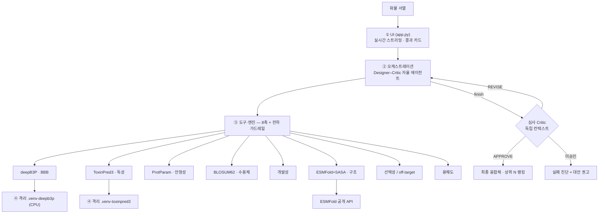
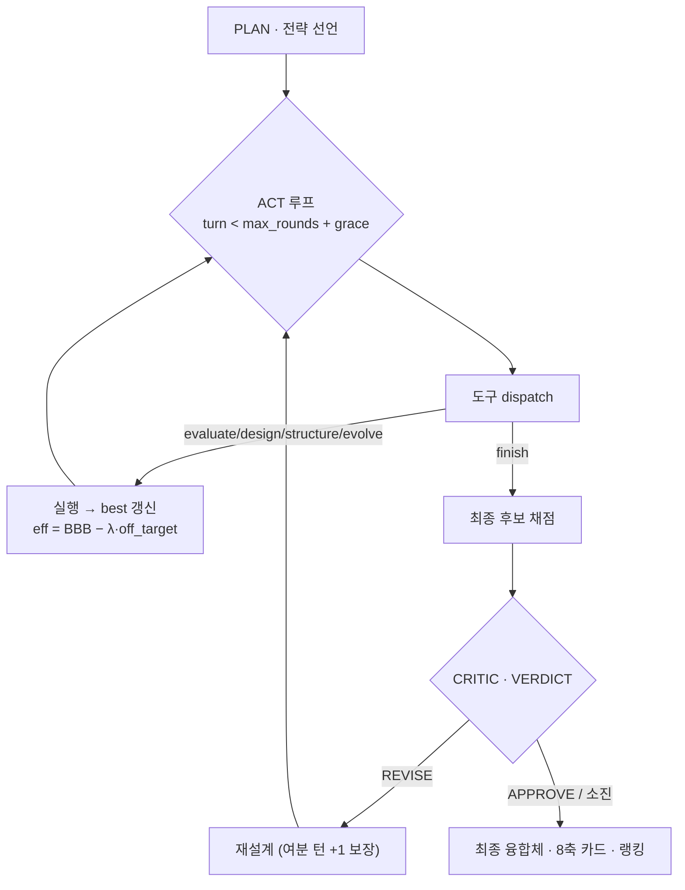

# 🧬 BBB-Optimize AI Agent

혈액뇌장벽(BBB)을 넘겨야 하는 **화물(cargo)**에 검증된 **셔틀·링커**를 붙여 뇌 전달 융합체
(`화물 + 링커 + 셔틀`)를 **자율 설계**하는 **Designer–Critic 멀티 에이전트**. 화물 서열을 넣으면
**설계 에이전트가 평가·잔기 편집·구조·서열 진화 도구를 스스로 오케스트레이션**하고, **독립 심사
에이전트가 적대적으로 검증**해 BBB 투과·독성·off-target·안정성·개발성·용해도를 저울질한 최종
후보로 수렴한다.

> **동기** — 항체(~150 kDa)는 BBB에 막혀 투여량의 **0.1~0.2%만 뇌에 도달**한다. 셔틀이 수용체매개
> 수송(RMT)을 편승(hitchhike)해 화물을 넘긴다. 산업 선례: Roche *Brain Shuttle* · Denali *Transport
> Vehicle* · **임상 3상 진입한 로슈 *Trontinemab***(TfR·monovalent).

> **공모전 분야 매핑** — 핵심 **분야2**(도구 활용 분자 최적화 루프) + **분야4**(융합·멀티 에이전트)
> + **분야1**(가설 생성·검증).

---

## ✨ 핵심 기능

- **자율 tool-use 에이전트** — `PLAN`(전략 선언) → `ACT`(도구 자율 호출) → `finish`(자기 종료) →
  `CRITIC`(독립 심사) → `REVISE`(재설계). 고정 파이프라인이 아니라 **중간 결과를 보고 다음 도구를
  스스로 결정**한다(effect: off-target이면 잔기 편집, 파묻히면 링커 교체, 부족하면 서열 진화).
- **🎯 지표 게이밍(reward-hacking) 회피 [독창성 핵심]** — deepB3P가 양이온성 CPP를 고평가하는 편향에
  낚인 **"BBB만 높은 off-target 후보"**를 **선택성 축**이 감점(`eff = BBB − λ·off_target`)하고 **독립
  심사**가 적대적으로 반박 → 비특이 CPP보다 **수용체 선택적 RMT 셔틀**을 선호.
- **🔬 전달 축 분해 (delivery decomposition)** — deepB3P 점수를 단일 오라클로 쓰지 않고 **셔틀 내재
  투과 × 융합 보존 × 메커니즘(RMT/CPP) 타당도 + avidity**로 분해해 "펩타이드 투과 점수 ↔ 항체 전달"의
  개념 혼동 없이 정직하게 해석.
- **🧬 서열 directed evolution** — 셔틀은 무작위 de-novo 생성 없이 **검증 리간드에서 시드**해
  point-mutation·crossover로 진화(링커와 **쌍째 co-evolution**). 진화물도 실제 리간드의 변이체.
- **📐 8축 평가** — BBB · 독성 · 안정성 · 수용체 유사도 · 개발성 · 구조 노출 · **선택성(off-target)** · 용해도.
- **✅ 정직한 미승인** — 전 후보 실패 시 결과를 위장하지 않고 **실패 진단 + 시스템 내 대안 권고**.

---

## 🎬 시연 (Demo)

```bash
streamlit run app.py
```

화물 서열 입력 → **`자율 설계 에이전트 실행`** → 한 세션(수십 초~수 분)이 **실시간 스트리밍**된다:

1. **화물 입력** — 펩타이드~항체(항상 화물, 단일 경로).
2. **PLAN 카드** — 도구 쓰기 전 전략 선언("근거 있는 탐색").
3. **ACT 스트리밍** — 평가·잔기 편집·구조·서열 진화 도구 호출이 이벤트 카드로 차례로 등장.
4. **[하이라이트] 지표 게이밍 간파** — 고BBB CPP off-target 후보 → 심사가 **REVISE** → 재설계 → APPROVE.
5. **전달 축 분해 표시** — 후보별 셔틀 내재·융합 보존·메커니즘·avidity 병기("이 숫자는 RMT라 참고치").
6. **최종 카드** — 8축 점수 + 순전하·μH + 전체 서열. 미승인 시 **실패 진단 + 대안 권고**까지 정직 표기.

> 발표 전 ESMFold 구조 캐시를 미리 데워두면 서버 상태와 무관하게 재현된다:
> `python scripts/prewarm_esmfold.py`

---

## 🧱 아키텍처 & 설계도

### 4계층 구조 (UI · 오케스트레이션 · 도구·엔진 · 격리 실행)



### 에이전트 제어 흐름 (`run()`)



**라이브러리**: **링커 13 × 셔틀 10 = 130 조합**
- RMT 셔틀: Angiopep-2·ApoE(159-167)₂·Leptin30 · **T7·B6 (TfR)** · **RVG29·CDX (nAChR)**
- CPP 셔틀: TAT · Penetratin · SynB1

---

## 📊 성능 평가 (Evaluation)

평가 세트·지표 설계 원리·실측은 **[EVALUATION.md](EVALUATION.md)** 참고. 재현:

```bash
python benchmark.py         # M1 판별력 · M2 최적성/탐색효율 · M3 독성 가드레일 (로컬, LLM 0회)
python benchmark_agent.py   # M4 에이전트 효율 · M5 심사 효과 (LLM 필요)
```

| 지표 | 실측 |
|---|---|
| **M1 판별력** | AUC **0.807**(양성 vs 무작위) |
| **M2 최적성** | 130조합 oracle 최적 BBB **0.960**(직접융합+SynB1) |
| **M3 가드레일** | 독소 **2/2 검출**(멜리틴·마스토파란), 오탈락 0 |
| **M4 에이전트 효율** | **22평가로 최적의 96.8%**(무작위 24평가 71.6% 대비) |
| **M5 심사 효과** | 불량 후보 **2/2 REVISE** |

> ⚠️ deepB3P는 짧은 펩타이드 학습 모델 — 긴 융합체는 조합 간 **상대 비교**로 해석하며 절대 투과율이
> 아니다. 구조 노출도·선택성·개발성은 **휴리스틱 프록시**. 실제 적용 전 In Vitro/In Vivo 검증 필요(Tier 로드맵).

---

## 🔬 예측 엔진 & 도구

| 축/기능 | 엔진 | 방식 |
|---|---|---|
| BBB 투과 | [deepB3P](https://github.com/GreatChenLab/deepB3P) | 펩타이드 서열 딥러닝 5-fold (로컬 CPU) |
| 독성 | [ToxinPred3](https://github.com/raghavagps/toxinpred3) | AAC+DPC → Extra-Trees (로컬, GPL-3.0) |
| 구조 | [ESMFold](https://esmatlas.com/) | 공개 API 폴딩 + Shrake-Rupley SASA |
| 수용체·선택성·개발성·용해도 | Biopython + 규칙 엔진 | BLOSUM62 정렬 · 서열 규칙 (로컬) |
| 서열 진화 | co-evolution 러너 | 라이브러리 시드 directed evolution (deepB3P venv, CPU) |
| 브레인(추론) | **Google Gemini**(기본) | 자율 최적화 에이전트 (Claude는 `with-claude` 브랜치) |

**에이전트 도구**: `evaluate_candidates`(8축 배치) · `design_candidate`(잔기 편집) ·
`analyze_structure`(ESMFold 노출도) · `evolve_from_library`(서열 진화 → 8축 재평가) · `finish`(자기 종료).

**자원 경량**: deepB3P·독성·진화는 **CPU 완결**, 구조는 ESMFold **공개 API** → 프런티어 GPU 불필요.

---

## ⚙️ 설치

### 1. 앱 본체
```bash
pip install -r requirements.txt        # streamlit
pip install biopython requests py3Dmol # 구조 분석·3D 뷰
```

### 2. 로컬 예측 엔진 (별도 클론 + 모델 + venv)
제3자 코드·모델 가중치는 이 repo에 포함하지 않는다(라이선스/용량). 아래로 재현:

```bash
mkdir -p vendor && cd vendor

# --- deepB3P (BBB 스코어러 + co-evolution 러너) ---
git clone https://github.com/GreatChenLab/deepB3P.git
python3 -m venv .venv-deepb3p
.venv-deepb3p/bin/pip install -r ../requirements-deepb3p.txt
cp ../scripts/deepb3p/_run_predict.py ../scripts/deepb3p/_run_fbgan.py \
   ../scripts/deepb3p/_run_coevo.py ../scripts/deepb3p/_physchem.py deepB3P/

# --- ToxinPred3 (독성) ---
git clone https://github.com/raghavagps/toxinpred3.git
python3 -m venv .venv-toxinpred3
.venv-toxinpred3/bin/pip install -r ../requirements-toxinpred3.txt
(cd toxinpred3/model && unzip -o toxinpred3.0_model.pkl.zip)
```

> `_run_fbgan.py`는 BBB 스코어러(`BBBScorer`)를 담고 있어 co-evolution 러너가 재사용한다(셔틀 de-novo
> 생성기는 쓰지 않음).

`core/config.py`가 `vendor/` 경로를 자동 감지해 로컬 엔진을 켠다.

### 3. LLM 에이전트 (선택)
```bash
cp .env.example .env   # .env 에 GEMINI_API_KEY 입력
```
키가 없으면 데모 모드로 예시 결과 화면을 미리볼 수 있다(값은 "예시"로 명시).

## ▶️ 실행
```bash
streamlit run app.py
```

---

## 📁 구조
```
app.py                      Streamlit UI (얇은 표시·스트리밍 계층)
core/
  config.py                 상수·경로 자동감지, 셔틀·링커 라이브러리, 연결부위 윈도우
  schemas.py                데이터 구조 (Verdict·PredictionResult·ToxicityResult)
  optimizer_agent.py        도구 백엔드(_evaluate 8축 · _structure · _coevolve)
  optimizer_agent_gemini.py 브레인 루프(PLAN→ACT→finish→CRITIC→REVISE)
  predictors.py             BBB 예측기 (deepB3P local / API / 폴백)
  toxicity.py               독성 예측기 (ToxinPred3 local / placeholder)
  delivery.py               전달 축 분해 (셔틀 내재 × 보존 × 메커니즘 + avidity)
  binding.py                수용체 유사도 (BLOSUM62, RMT/CPP 참조 세트)
  selectivity.py            선택성 / off-target (reward-hacking 회피 축)
  developability.py         개발성 liability·응집·전하
  stability.py              ProtParam 안정성
  solubility.py             용해도
  structure.py              ESMFold 구조 + 셔틀 노출도 (빠른 실패·캐싱)
  coevolution.py            링커·셔틀 서열 directed co-evolution 오케스트레이터
scripts/deepb3p/            deepB3P venv에서 도는 러너 (설치 시 vendor/deepB3P/ 로 복사)
scripts/prewarm_esmfold.py  발표용 ESMFold 구조 캐시 프리워밍
assets/theme.css            디자인 시스템(YumYum) 테마
```

## 📜 라이선스 주의
`vendor/`의 ToxinPred3는 **GPL-3.0**, deepB3P는 라이선스 미명시. 재배포·상업적 사용 시 각
저작자·라이선스를 확인할 것. 이 repo에는 포함하지 않는다.
