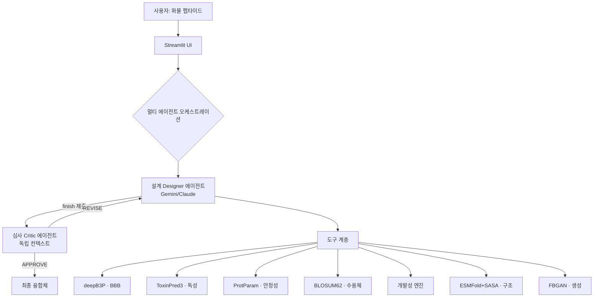

# BBB-Optimize — 상세 기획서

> 뇌혈관장벽(BBB)을 통과하는 항체-셔틀 융합 단백질을 자율적으로 설계·검증하는
> **멀티 에이전트 in-silico 신약설계 시스템**. 본 문서는 사용하는 기술·방법·이론·도구·원리를
> 총정리한 기술 기획서다.

---

## 1. 개요

| 항목 | 내용 |
|---|---|
| **목표** | 화물(cargo) 펩타이드를 입력하면, `융합체 = 화물 + 링커 + 셔틀`을 자율 설계해 **BBB 투과·안전성·구조·안정성·개발성**을 동시 만족하는 최종 후보를 도출 |
| **핵심 차별점** | 단일 예측이 아니라 **설계(Designer)–심사(Critic) 멀티 에이전트**가 도구를 오케스트레이션하며 스스로 계획·설계·검증·재설계 |
| **공모전 분야** | 분야2(도구 활용 분자 최적화 루프) 핵심 + 분야4(융합·멀티 에이전트) + 분야1(가설 생성·검증) |
| **정직한 스코프** | in-silico는 **실험 전 후보를 좁히는 사전 스크리닝** — 실제 투과율은 wet-lab이 확정 |

---

## 2. 배경 & 문제 정의

### 2.1 뇌 질환 치료의 병목 = BBB
뇌혈관장벽(Blood-Brain Barrier)은 혈관내피 세포의 tight junction으로 형성된 선택적 장벽으로,
분자량 큰 치료제(특히 항체, ~150 kDa)의 뇌 진입을 거의 막는다. 알츠하이머 항체 치료제도
**투여량의 0.1~0.2%만 뇌에 도달**하는 것이 근본 한계다.

### 2.2 해결 전략 — 항체-셔틀 융합
검증된 **셔틀 펩타이드**(예: Angiopep-2)를 링커로 항체에 연결해, 셔틀이 BBB의
**수용체 매개 수송(RMT, Receptor-Mediated Transcytosis)** 경로를 "히치하이킹"하게 한다.

**RMT 원리**: 셔틀이 혈관 쪽(luminal) 수용체(LRP1·TfR 등)에 결합 → 세포내이입(endocytosis)
→ 세포를 가로질러 수송(transcytosis) → 뇌 쪽(abluminal)에서 방출. 산업 사례: Roche
*Brain Shuttle*, Denali *Transport Vehicle*.

### 2.3 왜 어려운가 — 조합 폭발 + 상충
링커(길이·유연성·전하)와 셔틀 조합은 방대하고, **효능↑이 독성↑·불안정↑과 상충**한다.
게다가 RMT는 "친화도가 너무 높으면 뇌 쪽에서 안 떨어지는" **친화도 sweet-spot** 현상이 있어
단순 최대화가 답이 아니다. → **다목적을 저울질하는 자율 탐색**이 필요.

### 2.4 왜 자율 에이전트인가
고정 파이프라인은 "정해진 순서"만 수행한다. 실제 설계는 **관찰→판단→다음 행동**을 반복하는
문제다: 어떤 조합을 볼지, 언제 정밀 설계할지, 언제 구조 검증할지, 언제 멈출지를 **스스로 결정**해야
한다. 이것이 에이전트의 정의이자 본 과제(자율 에이전트)의 핵심.

---

## 3. 시스템 아키텍처



### 3.1 계층 구조
- **UI 계층** (`app.py`, Streamlit): 입력·라이브 스트리밍·결과 카드·과정 기록.
- **에이전트 계층** (`core/optimizer_agent*.py`): LLM 브레인 + tool-use 루프.
- **도구 계층**: 에이전트가 호출하는 액션(evaluate·design·structure·generate·finish).
- **엔진 계층** (`core/*.py`): 실제 예측·계산.
- **격리 실행**: deepB3P·ToxinPred3는 의존성 충돌(특히 scikit-learn 1.0.2 핀) 때문에
  **전용 가상환경에서 subprocess로 격리** 호출.

### 3.2 설계 원칙
- **의존성 주입**: `get_predictor()`·`get_toxicity_predictor()` 등 팩토리가 설정을 보고
  로컬 실측 > 원격 API > Mock 순으로 자동 선택.
- **관심사 분리**: UI는 얇게, 계산은 core, 데이터 구조는 dataclass(`schemas.py`).
- **이벤트 스트리밍**: 에이전트는 `AgentEvent`(plan/evaluation/structure/…/critique/final)를
  생성기로 yield → UI가 실시간 렌더.

---

## 4. 에이전트 설계 (이론 + 구현)

### 4.1 LLM Tool-Use(Function Calling) 원리
LLM에 **도구 스키마**(이름·설명·JSON 파라미터)를 제공하면, 모델은 자연어 대신 **구조화된 도구 호출**을
출력한다. 시스템이 그 도구를 실행하고 결과를 대화에 되돌려주면, 모델이 다음 수를 결정 —
이 **관찰→행동 루프**를 모델이 "그만"할 때까지 반복한다(수동 agentic loop).

### 4.2 실행 루프 — 계획·실행·자기종료·심사·재설계
```
PLAN(전략 선언) → ACT(도구 자율 호출: 평가·정밀설계·구조·생성)
  → 수렴 판단 시 finish(자기 종료) → CRITIC(독립 심사) → APPROVE ┐
                                                     └ REVISE → 재설계 …
```
- **계획(Plan)**: 도구 쓰기 전 전략을 명시적으로 선언 → 근거 있는 탐색.
- **자기 종료(finish)**: 고정 스텝 소진이 아니라 "충분히 수렴"을 **에이전트가 스스로 선언**.
- **정밀 설계(design_candidate)**: 라이브러리 선택을 넘어 **잔기 수준 편집** 서열을 직접 제안 →
  진짜 "설계" 행동공간.

### 4.3 멀티 에이전트 — Designer–Critic (적대적 검증)
- **설계 에이전트**: 후보를 만들고 finish로 제출.
- **심사 에이전트**: **독립 페르소나·독립 컨텍스트**(설계자 추론에 오염되지 않음)로 후보를
  적대적으로 반박 — 독성 마진·안정성·BBB 신뢰도·구조 근거·**개발성 liability**·설계 실질을 따져
  `VERDICT: APPROVE/REVISE`. REVISE면 심사 반박을 설계자에 피드백해 재설계.
- **이론적 근거**: 단일 에이전트의 자기확신 편향을, **독립적 반대 관점**으로 교정하는
  generator–discriminator/adversarial verification 패턴.

### 4.4 이중 브레인 — Gemini(기본) / Claude
동일 도구·동일 결과 파이프라인에 브레인만 교체 가능.
- **Gemini**(기본): 정직한 BBB 생물학 프레이밍 그대로 수용.
- **Claude**: 안전 분류기가 "BBB 통과 구조 최적화"를 **오탐 거부** → **도메인 중립화**로 우회
  (LLM에는 primary/penalty/index/match 같은 추상 최적화로만 제시, 생물학 계산·UI는 그대로 유지,
  출력은 생물학 용어로 복원). → **동일 과제를 두 프런티어 모델이 다르게 다루는 실증**이자 AI 안전
  오탐에 대한 엔지니어링 인사이트.

---

## 5. 예측 엔진 & 이론적 원리

각 엔진은 **무엇을·어떤 원리로·어떤 한계로** 계산하는지 명시한다.

### 5.1 deepB3P — BBB 투과 (효능)
- **무엇**: 펩타이드 서열 → BBB 투과 클래스 **확률(0~1)**.
- **원리**: 딥러닝(트랜스포머 계열) 분류기, **5-fold 앙상블**로 안정화. 아미노산 서열을 임베딩해
  투과/비투과를 학습.
- **한계**: 짧은 펩타이드로 학습 → 긴 융합체의 **절대값 신뢰도 낮음**. 분류 확률이지 실제 투과율 아님.
  양이온성 CPP에 편향(벤치마크 M1에서 확인).

### 5.2 ToxinPred3 — 독성 (안전성)
- **무엇**: 펩타이드 → 독성 위험도(0~1), **> 0.38 탈락**.
- **원리**: **AAC(아미노산 조성) + DPC(이펩타이드 조성)** 특징 → **Extra-Trees** 앙상블(ML-only 모델).
  조성 기반이라 길이 무관, 전체 서열에 적용.
- **한계**: 조성 기반 → 서열 순서·구조 의존 독성은 약함. (GPL-3.0)

### 5.3 ProtParam — 안정성
- **무엇**: 융합체 자체의 분해·응집 경향.
- **원리(불안정성 지수, Guruprasad 1990)**: 서열의 **이펩타이드별 불안정 가중치(DIWV)** 합 ×(10/길이).
  **< 40이면 안정** 예측. 보조: 지방족 지수(Ikai 1980, 지방족 곁사슬 상대 부피), GRAVY(Kyte-Doolittle
  소수성 평균).
- **한계**: 서열 경험식 — 실측 Tm/ΔG 아님.

### 5.4 BLOSUM62 정렬 — 수용체 유사도 (메커니즘 프록시)
- **무엇**: 후보 셔틀이 검증 셔틀과 얼마나 닮았나 → 수송 메커니즘 근거.
- **원리**: **BLOSUM62 치환 행렬**(정렬된 단백질 블록의 치환 로그-확률) 기반 **전역 정렬**
  (Needleman-Wunsch, Biopython `PairwiseAligner`). 참조 셔틀(Angiopep-2=LRP1 RMT, TAT/Penetratin/
  SynB1=CPP)과의 점수를 자기점수로 정규화(0~1).
- **한계**: **서열 유사도 프록시지 결합 친화도 아님** — Angiopep과 다른 신규 결합자는 낮게 나옴.

### 5.5 ESMFold + Shrake-Rupley SASA — 구조 접근성
- **무엇**: 융합체를 접었을 때 셔틀이 표면 노출인가 vs 화물에 가려졌나.
- **원리**:
  - **ESMFold**: ESM-2 단백질 **언어모델**이 MSA 없이 서열→3D 구조 예측(공개 API). 잔기별 신뢰도
    **pLDDT**(0~100) 동반.
  - **Shrake-Rupley**: 각 원자 주위에 구(球) 점을 뿌려 용매 접근 가능 표면적(**SASA**) 산출 →
    셔틀 영역 **상대 노출도(RSA)**. ≥0.35이면 노출로 판정.
- **한계**: 짧은 펩타이드는 무질서 → 저신뢰(pLDDT 낮음). 노출도는 휴리스틱 프록시(검증된 구조→BBB
  모델 아님).

### 5.6 개발성 엔진 — Developability (서열 liability·응집·전하)
- **무엇**: "만들기 어렵다/불안정하다/비특이 위험"을 실험 전 선별 (TAP 항체 프로파일러의 펩타이드판).
- **원리(생화학)**:
  - **탈아마이드화** N-[G/S/T]: Asn 뒤 작은 잔기 → succinimide 경유 Asn→Asp/isoAsp (NG 최고속).
  - **이성질화** D-[G/S/T/D/H]: Asp succinimide → isoAsp.
  - **N-당화 sequon** N-X-[S/T](X≠P): oligosaccharyltransferase 인식 부위.
  - **자유 Cys**: 짝 없는 시스테인 → 이황화 스크램블·이량체화·응집.
  - **산화** Met/Trp: 표면 노출 시 산화 → 기능 변화·응집.
  - **프로테아제 절단부위** RR/KR/RK/KK: furin·트립신 유사 절단 → 체내 안정성↓.
  - **응집 경향**: 소수성·방향족 패치가 자기회합 유발(휴리스틱: 소수성 비율 + 최장 연쇄).
  - **전하**: pH 7.4 순전하·전하밀도 — **양이온 과다 = 비특이 결합·독성·빠른 청소**(셔틀이 양이온성
    많아 특히 중요).
- **산출**: 위험 낮음/보통/높음 + liability 목록. 검증: TAT 융합=높음(순전하 +8), GS링커=낮음(0).

### 5.7 FBGAN — 신규 셔틀 생성
- **무엇**: 라이브러리 밖 novel 셔틀 서열 생성.
- **원리**: **Feedback GAN** — 사전학습 생성기가 서열을 만들고, deepB3P·ToxinPred3 피드백으로
  **잠재공간(latent z)을 진화**시켜 적합도(BBB↑·독성↓) 높은 방향으로 수렴(원본 GAN 재학습 대신
  CPU 안정형 잠재 진화 채택).
- **한계**: 생성물은 자연·검증 서열 아님 → 실험 검증 필수.

---

## 6. 지표 점수 산정 방식 (정밀)

| 지표 | 산정식/알고리즘 | 범위·기준 | 해석 |
|---|---|---|---|
| BBB 투과 점수 | deepB3P 5-fold 앙상블 확률. 융합체 >50aa면 **연결부위(링커+셔틀)만 윈도잉** | 0~1 | 상대 비교용(실제 투과율 아님) |
| 독성 | ToxinPred3(AAC+DPC→Extra-Trees), 전체 서열 | >0.38 탈락 | 안전성 스크리닝 |
| 안정성 | ProtParam 불안정성 지수(Guruprasad) | <40 안정 | 분해·응집 경향 |
| 수용체 유사도 | BLOSUM62 전역정렬 / 자기점수 정규화 | 0~1 | 수송 메커니즘 근거 |
| 구조 노출도 | ESMFold → Shrake-Rupley RSA + pLDDT | ≥0.35 노출 | 셔틀 접근성 |
| 개발성 | liability 모티프 + 응집 휴리스틱 + pH7.4 순전하/밀도 | 낮음/보통/높음 | 제조·안정성 위험 |

---

## 7. 연결부위 윈도잉 (설계 근거)

**문제**: 항체 융합체(수백 aa)는 deepB3P 학습 분포(짧은 펩타이드) 밖 → 전체 서열 점수 신뢰 불가.

**해법**: 융합체가 50aa 초과 시 BBB는 **연결부위(링커+셔틀)만** 계산(화물 벌크 제외, 독성은 전체 서열).

**정당성(단순 우회가 아님)**: 항체 화물은 **혼자선 BBB를 못 넘고**, 투과를 담당하는 건 **오직 셔틀**이다.
→ 연결부위만 보는 것은 길이 제약 회피이자 **실제 투과 기능 모듈만 정확히 겨냥**하는 것. 화물 벌크를
넣으면 조성 편향 노이즈만 섞인다(검증: 화물 포함 시 링커 민감도 소실 → flank=0 채택).

---

## 8. 성능 평가 방법론 (Evaluation Set + Metrics)

`benchmark.py`(로컬·LLM 0회) / `benchmark_agent.py`(LLM 필요). 상세 `EVALUATION.md`.

| 지표 | 방법 | 실측 |
|---|---|---|
| **M1 판별력** | 양성(CPP/셔틀 12) vs 무작위/스크램블 deepB3P 점수 분리(AUC) | AUC **0.807**(양성vs무작위) |
| **M2 최적성·효율** | 라이브러리 전수(oracle) 최적 vs 무작위 탐색 효율 곡선 | 최적 BBB **0.960**(직접융합+SynB1), 무작위 24회→85% |
| **M3 가드레일** | 알려진 독소(멜리틴·마스토파란) 탈락 검증 | 검출 **2/2** |
| M4 에이전트 효율 | 에이전트 평가 횟수 vs oracle·무작위 (LLM) | 라이브 대기 |
| M5 심사 효과 | 불량 후보 REVISE 검출률 (LLM) | 라이브 대기 |

---

## 9. 계산의 역할과 한계 — Tier 로드맵

**핵심 인식: 전장 융합체의 실제 BBB 투과율은 서열만으론 원리적으로 예측 불가.** RMT는 셔틀-수용체
결합(친화도·결합가·pH 의존성)에 좌우되고, 이는 실험 물리량이다.

| Tier | 추가 정보 | 가능해지는 것 | 우리 위치 |
|---|---|---|---|
| 1 | 서열만 | 셔틀 모듈 **상대 순위** | ✅ |
| 2 | +3D 구조(복합체 co-folding) | 결합 타당성·대략 랭킹 | 부분(단량체 구조까지) |
| 3 | +측정 친화도(SPR/BLI, pH) | **친화도 sweet-spot 정량 모델링** | 실험 데이터 필요 |
| 4 | +뇌흡수 데이터셋 | 계열 내 ML 예측 | 실험 데이터 필요 |
| 5 | 기전 PBPK 모델 | 뇌 농도-시간 시뮬레이션 | 파라미터 필요 |

**포지셔닝**: 우리는 Tier 1~2(계산이 유효한 영역)에서 **후보를 좁히고**, 그다음은 wet-lab으로 넘긴다.
"어디까지가 계산의 몫인지 정확히 아는 것"이 도메인 성숙도. 실험 데이터가 들어오면 Tier 3+로 확장되는
구조로 설계.

---

## 10. 기술 스택 & 재현성

| 구분 | 기술 |
|---|---|
| 언어·UI | Python 3.9, Streamlit |
| LLM 브레인 | Google Gemini(`google-genai`, function calling) / Anthropic Claude(`anthropic`) |
| 서열·구조 | Biopython(정렬·SASA·ProtParam), ESMFold 공개 API, requests, py3Dmol(3D 뷰) |
| 예측 모델 | deepB3P(PyTorch, 격리 venv), ToxinPred3(scikit-learn 1.0.2, 격리 venv), FBGAN |
| 미사용 | **RDKit 등 저분자 도구** — 펩타이드/단백질 모달리티에 부적합(Ro5 등 미적용) |

**재현성**: 제3자 코드·가중치는 라이선스·용량상 repo 제외, `README.md`에 clone+모델+venv 절차.
벤치마크(M1~M3)는 로컬 엔진만으로 누구나 `python benchmark.py`로 재현.

---

## 11. 한계 & 향후 확장

**한계(정직성)**
- BBB 점수는 분류 확률 — 실제 투과율(Papp/logBB)은 in-silico 확정 불가.
- deepB3P 절대값 신뢰도 낮음(양이온 편향), 수용체 유사도는 서열 프록시, 구조 노출도는 휴리스틱.
- 실제 개발 전 In Vitro(transwell Papp)/In Vivo(brain:plasma) 검증 전제.

**확장**
- Tier 2 강화: 셔틀-수용체 **복합체 co-folding**(AlphaFold-Multimer/Boltz)로 결합 타당성.
- Tier 3 훅: **측정 친화도 입력** 시 sweet-spot 근접도 점수화.
- 분야3 확장: 규제·개발성 에이전트 추가(2+3 융합).
- 면역원성(T-cell epitope) 엔진 추가.

---

## 12. 공모전 분야 매핑

| 분야 | 부합 | 근거 |
|---|---|---|
| **분야2** 도구 활용 분자 최적화 루프 | 🟢 핵심 | 예측 도구를 루프로 돌려 분자 최적화 — 정의 그대로 |
| **분야4** 융합·멀티 에이전트 | 🟢 | Designer–Critic 멀티 에이전트 구조 |
| **분야1** 자율형 가설 생성·검증 | 🟡 | 후보 가설 생성 + 다중 도구 검증 |
| 분야3 규제·임상 | ⚪ 향후 | 개발성 축이 규제 대응의 초석(확장 여지) |
