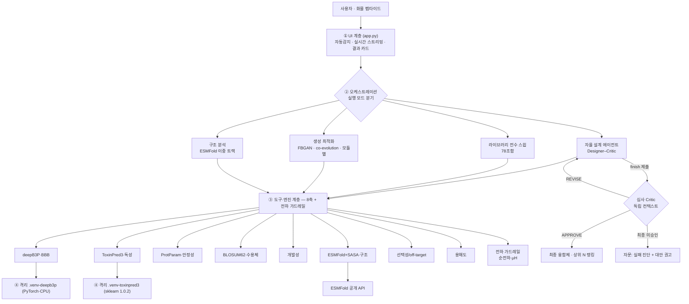
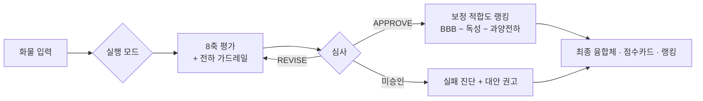

# BBB-Optimize — 상세 기획서

> 뇌혈관장벽(BBB)을 통과하는 항체-셔틀 융합 단백질을 자율적으로 설계·검증하는
> **멀티 에이전트 in-silico 신약설계 시스템**. 본 문서는 사용하는 기술·방법·이론·도구·원리를
> 총정리한 기술 기획서다.

---

# 📄 제출 요약 (공식 `<요약>` 서식)

> **제출 서식**: 함초롬돋움 13pt · 줄간격 130%. 각 항목의 `[참고사항]`은 제출 전 삭제.
> 8개 항목은 예선 평가 루브릭과 1:1 대응한다. 상세 근거는 하단 「부록: 기술 상세」 참조.

## 1. 신약개발에서의 에이전트 활용의 필요성과 배경

**해결하려는 문제**: 뇌 질환 치료제(특히 항체, ~150 kDa)는 혈액뇌장벽(BBB)에 막혀 **투여량의
0.1~0.2%만 뇌에 도달**한다. 이를 뚫기 위해 검증된 **셔틀 펩타이드**를 링커로 항체에 융합해
**수용체매개수송(RMT)**을 히치하이킹하지만, `링커 × 셔틀 × 잔기` 설계 공간은 방대하고
**효능↑이 독성·불안정·off-target과 상충**하며, RMT는 "친화도가 너무 높으면 뇌 쪽에서 안 떨어지는"
**sweet-spot** 현상까지 있어 단순 최대화가 답이 아니다. → **다목적을 저울질하는 자율 탐색**이 필요.

**도메인 지식의 반영**: RMT 기전(LRP1/TfR luminal 결합 → transcytosis), 산업 선례(Roche
*Brain Shuttle*·Denali *Transport Vehicle*), 셔틀별 수용체, 친화도 sweet-spot, 개발성
liability(탈아마이드화·이성질화·N-당화·산화·프로테아제 절단)를 **평가 축과 에이전트 판단 로직에 직접
인코딩**했다. 계산이 유효한 범위(서열 기반 상대 순위)와 실험이 필요한 범위(절대 투과율)를 구분하는
Tier 로드맵도 도메인 성숙도로 제시한다.

## 2. 에이전트 설계 및 설계의 독창성과 창의성

**단순 챗봇을 넘어선 자율 설계**: LLM tool-use 루프 — **PLAN**(전략 선언) → **ACT**(평가·정밀설계·
구조·생성 도구를 스스로 호출) → **finish**(수렴을 스스로 선언) → **CRITIC**(독립 심사) →
**REVISE**(재설계). 라이브러리 선택을 넘어 **잔기 수준 서열 편집**을 직접 제안하는 진짜 설계 행동공간.

**차별화된 아키텍처(멀티 에이전트 + 피드백 루프)**:
- **Designer–Critic 멀티 에이전트**: 심사가 **독립 컨텍스트**로 후보를 적대적으로 반박(8축 + 설계 실질) → APPROVE/REVISE.
- **지표 게이밍(reward-hacking) 간파 [독창성 핵심]**: deepB3P가 양이온 CPP를 고평가하는 편향을 이용한 **"BBB는 높지만 아무 세포나 뚫는 off-target"** 후보를 심사가 **선택성 축**으로 잡아 뒤집는다(실측: BBB 0.96 후보를 REVISE).
- **[신규] 링커·셔틀 잠재 co-evolution**: 개체 = (셔틀 잠재 z, 링커 펩타이드) 두 모듈을 **동시 진화** — 좋은 셔틀 잠재와 좋은 링커 계통이 교차·재조합되며 공진화.
- **[신규] 양전하 편향 가드레일**: 생성 적합도에 순전하(pH 7.4) + 양친매성(μH) 페널티를 주입해, 편향을 평가 단계뿐 아니라 **생성 단계에서 원천 억제**(무지성 양이온만 감점, Angiopep-2 같은 정당한 RMT 셔틀은 보존).
- **실패 시 대안 권고**: 전 후보 미승인이면 원인을 데이터로 진단하고 **실행 가능한 다음 수**(신규 셔틀 생성·링커 교체 등)를 권고.

## 3. 기술적 실현 가능성

**오픈소스 엔진 실동작**: deepB3P(BBB, PyTorch) · ToxinPred3(독성, scikit-learn) · ESMFold
(구조, 공개 API) · FBGAN·co-evolution(생성) · Biopython(정렬·SASA·ProtParam). 의존성 충돌
(scikit-learn 1.0.2 핀 등)은 **전용 venv subprocess 격리**로 해결. 설정 자동감지로 로컬 실측 >
원격 API > Mock 순 선택.

**제한된 자원하 현실성**: deepB3P·생성 진화 모두 **CPU로 동작**(원본 GAN 재학습 대신 사전학습 생성기
고정 + 잠재공간 진화 채택). ESMFold는 공개 API라 **로컬 GPU 불요** → **노트북/단일 서버에서 완결**,
상시 GPU 불필요. 저분자 도구(RDKit 등)는 펩타이드/단백질 모달리티에 부적합해 **의도적으로 배제**.

## 4. 에이전트 평가 적절성

**Evaluation set + 지표 M1~M5 실측**(`benchmark.py` 로컬 재현):

| 지표 | 방법 | 실측 |
|---|---|---|
| M1 판별력 | 양성(CPP/셔틀) vs 무작위 deepB3P 분리 | **AUC 0.807** |
| M2 최적성 | 78조합(링커13×셔틀6) oracle 최적 | 최적 BBB **0.960** |
| M3 가드레일 | 알려진 독소(멜리틴·마스토파란) 탈락 | **2/2 검출**, 오탈락 0 |
| M4 에이전트 효율 | 평가 횟수 vs oracle | **11평가로 최적의 93.0%**(무작위 12평가 67.7%) |
| M5 심사 효과 | 불량 후보 REVISE 검출 | **2/2 REVISE** |

**편향 정량·보정 검증(신규)**: 양전하 가드레일 단위검증 — TAT(+8)→페널티 0.20, **Angiopep-2(+2)→0**
(정당한 RMT 셔틀 보존). co-evolution 재실행 시 우승자 순전하 **+4 → +1** 로 저전하화 확인.

## 5. AI 활용 투명성 및 연구 윤리

**AI를 연구동료로 활용(명시)**: 엔진 설계·코드 구현·문서 작성에 LLM 어시스턴트를 **공동개발자**로
활용했다. 브레인 모델(Gemini 기본, Claude 구현은 `with-claude` 브랜치 보존)·설정·프롬프트를 공개하고,
에이전트의 **계획·추론·평가·심사 전 과정을 실시간 스트리밍·기록**해 재현·감사 가능하다.

**AI 생성 가설의 타당성 검증**: FBGAN·co-evolution이 만든 신규 서열은 **AI 설계 가설로 명시**
(실험·검증 서열로 위장 금지)하고, **심사 에이전트의 적대적 검증 + M1~M5 벤치마크**로 타당성을 점검한다.
평가세트 서열은 문헌 실측이며 **서열 날조 금지**가 원칙.

**유해 물질 오남용 방지(dual-use)**: BBB 전달의 이중용도 성격을 인식하고, **독성 스크리닝
(ToxinPred3, M3 2/2 검출) + 양전하 가드레일**을 안전판으로 내장해 유해·비특이 후보를 자동 탈락시킨다.
목적은 **치료제의 뇌 전달**(유익)이며 유해 화물 설계가 아니다. in-silico 결과는 **실험 검증 전 사전
스크리닝**임을 일관 명시하고 최종 판단·책임은 연구자에게 귀속.

## 6. 본선 시연 시나리오 — 단계적 문제해결의 시각화

에이전트의 문제해결 전 과정을 **Streamlit UI에 실시간 스트리밍**하도록 이미 구현돼 있어, "블랙박스
결과"가 아니라 **사고·판단 과정 자체**를 보여준다.

**라이브 흐름(한 세션 ≈ 수십 초~수 분)**
1. **입력**: 화물 펩타이드 1개 → 자동 감지가 펩타이드/항체 경로 분기.
2. **PLAN 카드**: 도구 사용 전 전략을 선언 → 화면 렌더("근거 있는 탐색").
3. **ACT 스트리밍**: 평가·정밀설계·구조·생성 도구 호출이 이벤트 카드로 차례로 등장(도구·입력·점수).
4. **[하이라이트] 지표 게이밍 간파**: 설계자의 BBB 0.96 후보 → 심사가 **양이온 off-target으로 REVISE** → 재설계 → APPROVE. 에이전트가 스스로를 반박·교정하는 순간을 화살표·배지로 강조.
5. **진화 데모**: FBGAN·**링커-셔틀 co-evolution** → **라운드별 BBB 개선 + 평균 순전하 하강(양이온 편향 억제)** 라인차트로 시각화.
6. **최종 카드**: 8축 요약 + **순전하·μH 병기** + 전체 서열. 미승인 시 **실패 진단 + 대안 권고**까지 정직 표기.

**시각화 요소**: 이벤트 타임라인 · 8축 배지 · 진화 라인차트(BBB↑·전하↓) · 구조 3D 뷰(py3Dmol) ·
심사 REVISE→재설계 화살표.

## 7. API 및 GPU 관련 예상 소요 규모

**설계 철학: 자원 경량 — 프런티어 GPU 없이 노트북/단일 서버에서 완결.**

- **LLM 추론(브레인)**: Gemini API(function calling). 1 세션 = PLAN 1 + ACT n + finish + 심사 1~2 + 재설계 → **세션당 ~10~30 호출**(gemini-3-flash, 저비용·저지연). 브레인은 교체 계층.
- **구조 예측 API**: ESMFold 공개 API, 융합체 1건당 1 호출(로컬 GPU 불요).
- **GPU**: deepB3P 추론·FBGAN·co-evolution 전부 **CPU 완결**(선택적 GPU). 로컬 학습/대규모 병렬이 필요해지는 지점은 **Tier 2 확장(AlphaFold-Multimer/Boltz 복합체 co-folding)**이며 그때 A100급 1장·건당 분 단위 예상.

| 항목 | 용도 | 예상 규모 |
|---|---|---|
| Gemini API | 에이전트 브레인 | 세션당 ~10~30 호출 |
| ESMFold API | 융합체 구조 예측 | 건당 1 호출 |
| GPU(현재) | deepB3P·생성 진화 | **선택적**(CPU 완결) |
| GPU(Tier2) | 복합체 co-folding | A100급 1장·건당 분 단위 |

## 8. 에이전트 도입에 따른 파급효과

**시간·비용 절감(사전 스크리닝 funnel)**: 후보를 실험으로 하나씩 합성·검증하면 비용·시간·**동물실험**
부담이 크다. 링커13×셔틀6=78 조합 + 잔기 정밀설계·신규 생성(사실상 무한) → **8축 평가·적대적 심사로
상위 소수만** 실험 대상 선별. 심사가 off-target·불안정 후보를 앞단에서 탈락 → 후행 실패비용 제거.

**제약바이오 적용성**: 항체의 뇌 전달은 제약업 대표 난제(Roche·Denali 실제 플랫폼 존재)로 문제의식이
산업과 정렬. 뇌표적 신약 **초기 후보 발굴** 단계의 셔틀·링커 조합 선별 **의사결정 보조 도구**이며,
투명한 과정 기록으로 채택성이 높다.

**프로세스 혁신 & 산업 경쟁력**: ① 고정 파이프라인 → **관찰·판단·재설계 자율 에이전트**로 탐색 패러다임
전환. ② **reward-hacking 방지 내장**으로 AI 자율설계의 신뢰성 문제를 구조적으로 완화 — 산업 이식의 핵심
가치. ③ 브레인·도구·평가축이 교체·확장 가능 → 다른 모달리티·표적·규제/면역원성 축으로 수평 확장하고,
실험 데이터가 쌓이면 **Tier 3+**(측정 친화도·뇌흡수 ML)로 성장하는 지속가능 플랫폼.

---

# 부록: 기술 상세 (backing detail)

> 아래는 위 요약의 상세 근거 — 아키텍처·엔진 원리·스코어링·벤치마크·윤리·한계.

## 1. 개요

| 항목 | 내용 |
|---|---|
| **목표** | 화물(cargo) 펩타이드를 입력하면, `융합체 = 화물 + 링커 + 셔틀`을 자율 설계해 **8축(BBB 투과·안전성·안정성·수용체유사·구조·개발성·선택성(off-target)·용해도)**을 동시 만족하는 최종 후보를 도출 |
| **핵심 차별점** | ① **설계(Designer)–심사(Critic) 멀티 에이전트**가 도구를 오케스트레이션하며 스스로 계획·설계·검증·재설계 · ② 심사가 **주 지표(BBB)를 속인 후보(양이온 편향 off-target)를 간파·반려** — 지표 게이밍(reward-hacking) 방지 · ③ 막다른 결과엔 **실패 진단 + 대안 권고** |
| **공모전 분야** | 분야2(도구 활용 분자 최적화 루프) 핵심 + 분야4(융합·멀티 에이전트) + 분야1(가설 생성·검증) |
| **정직한 스코프** | in-silico는 **실험 전 후보를 좁히는 사전 스크리닝** — 실제 투과율은 wet-lab이 확정 |

---

## 2. 배경 & 문제 정의

### 2.1 뇌 질환 치료의 병목 = BBB
뇌혈관장벽(Blood-Brain Barrier)은 혈관내피 세포의 tight junction으로 형성된 선택적 장벽으로,
분자량 큰 치료제(특히 항체, ~150 kDa)의 뇌 진입을 거의 막는다. 알츠하이머 항체 치료제도
**투여량의 0.1~0.2%만 뇌에 도달**하는 것이 근본 한계다.

### 2.2 해결 전략 — 항체-셔틀 융합
검증된 **셔틀 펩타이드**(예: Angiopep-2)를 링커로 항체에 연결해, 셔틀이 BBB의
**수용체 매개 수송(RMT, Receptor-Mediated Transcytosis)** 경로를 "히치하이킹"하게 한다.

**RMT 원리**: 셔틀이 혈관 쪽(luminal) 수용체(LRP1·TfR 등)에 결합 → 세포내이입(endocytosis)
→ 세포를 가로질러 수송(transcytosis) → 뇌 쪽(abluminal)에서 방출. 산업 사례: Roche
*Brain Shuttle*, Denali *Transport Vehicle*.

### 2.3 왜 어려운가 — 조합 폭발 + 상충
링커(길이·유연성·전하)와 셔틀 조합은 방대하고, **효능↑이 독성↑·불안정↑과 상충**한다.
게다가 RMT는 "친화도가 너무 높으면 뇌 쪽에서 안 떨어지는" **친화도 sweet-spot** 현상이 있어
단순 최대화가 답이 아니다. → **다목적을 저울질하는 자율 탐색**이 필요.

### 2.4 왜 자율 에이전트인가
고정 파이프라인은 "정해진 순서"만 수행한다. 실제 설계는 **관찰→판단→다음 행동**을 반복하는
문제다: 어떤 조합을 볼지, 언제 정밀 설계할지, 언제 구조 검증할지, 언제 멈출지를 **스스로 결정**해야
한다. 이것이 에이전트의 정의이자 본 과제(자율 에이전트)의 핵심.

---

## 3. 시스템 아키텍처

시스템은 **4개 계층**(UI · 오케스트레이션/실행모드 · 도구·엔진 · 격리 실행)으로 나뉜다. 사용자가
고른 **실행 모드**가 8축 평가·생성 도구를 호출하고, 무거운 예측 모델은 의존성 충돌을 피해 **전용 venv
subprocess**로 격리 실행된다. 전체 다이어그램(8종)은 별도 문서 [아키텍처.md](아키텍처.md) 참조.



### 3.1 계층별 책임 (4계층)

| 계층 | 코드 | 책임 | 핵심 포인트 |
|---|---|---|---|
| **① UI** | `app.py`(Streamlit) | 입력 자동감지(펩타이드/항체 분기), 실행모드 버튼, 이벤트 실시간 렌더, 결과 카드, 과정 기록 | 계산 로직 없는 **얇은 계층** — 표시·스트리밍만 |
| **② 오케스트레이션** | `core/optimizer_agent*.py`, `core/agent.py` | 실행 모드 분기, LLM tool-use 루프, Designer–Critic 조율 | 브레인(LLM)은 **교체 가능 계층** |
| **③ 도구·엔진** | `core/*.py` | 8축 평가·생성·구조 예측·전하 가드레일 | 각 엔진은 **독립 모듈**(단일 책임) |
| **④ 격리 실행** | `vendor/*`, venv | deepB3P·ToxinPred3·생성 러너를 전용 venv subprocess로 호출 | 의존성 충돌(**sklearn 1.0.2 핀**) 격리 |

- **② 오케스트레이션**은 도구를 **액션 스키마**(evaluate·design_candidate·structure·generate·finish)로
  LLM에 노출하고, 모델의 도구 호출을 실행→결과 반환하는 **관찰→행동 루프**를 돌린다(§4).
- **③ 엔진**은 서로 독립이라 축을 추가·교체해도 다른 축에 영향이 없다(선택성·용해도 축은 후발 추가됨).
- **④ 격리**: deepB3P(PyTorch)와 ToxinPred3(scikit-learn 1.0.2)는 의존성이 충돌 → 각자 venv에서
  `subprocess`로 호출하고 JSON으로 결과 회수. 생성 러너(FBGAN·co-evo·모듈별)도 deepB3P venv에서 실행.

### 3.2 전체 흐름 — 입력에서 결과 도출까지

입력 1개가 **실행모드 → 8축 평가 + 가드레일 → 심사 → 랭킹 → 산출물**로 수렴한다. 결과는 세 갈래:
**① 승인된 최종 융합체(서열 + 8축 점수카드 + 순전하·μH)**, **② 상위 N 랭킹**, **③ 미승인 시 실패
진단 + 대안 권고**. 모든 과정은 스트리밍·기록되어 **재현·감사 가능**하다.



### 3.3 실행 모드 4종 (구조적 분기)

사용자는 목적에 따라 4가지 모드를 고른다. 모두 같은 8축 엔진을 공유하지만 **탐색 전략**이 다르다.

| 모드 | 탐색 방식 | 산출 | 용도 |
|---|---|---|---|
| **자율 설계 에이전트** | LLM이 도구를 스스로 오케스트레이션(PLAN→ACT→finish→심사) | 승인된 최종 융합체 + 근거 | 지능형 자율 설계(주력) |
| **라이브러리 전수 스윕** | 링커13 × 셔틀6 = 78조합 완전탐색(oracle) | 전체 랭킹 | 기준선·최적성 검증 |
| **생성 최적화** | 라이브러리 밖 신규 서열을 진화 생성(3전략, §3.4) | 신규 셔틀·링커 후보 | 라이브러리 한계 돌파 |
| **구조 분석(이중 트랙)** | ESMFold 접기 + 투과/수용체 점수 | 구조 노출도·pLDDT | 특정 조합 정밀 검증 |

### 3.4 생성 최적화 3전략의 구조

라이브러리 밖 신규 서열을 만드는 세 접근. 모두 deepB3P·ToxinPred3 채점 + 전하 가드레일을 공유하되
**진화 대상·상호작용 처리**가 다르다(엔진 원리는 §5.7).

| 전략 | 진화 대상 | 링커·셔틀 궁합 | 독성 예측 호출 | 성격 |
|---|---|---|---|---|
| **FBGAN** | 셔틀 latent z만 | 링커 고정 | 매 라운드 | 단순·셔틀 신규 생성 |
| **co-evolution** | (셔틀 z, 링커) 동시 | 진화 중 반영 | 매 라운드 | 궁합 탐색 |
| **모듈별** | 셔틀·링커 각자 공간 | **조립 재순위**에서 회수 | **조립 1회** | 빠름·해석적 |

> 모듈별의 궁합 회수 근거: 셔틀 단독 BBB 100 → 조립 후 59 하락. "각자 최적화 후 그냥 붙이기"는
> 이 하락을 놓치지만, 조립 재순위가 잡아낸다.

### 3.5 설계 원칙

- **의존성 주입**: `get_predictor()`·`get_toxicity_predictor()`·`get_fbgan()`·`get_coevolution()`·
  `get_modular()` 팩토리가 설정을 보고 **로컬 실측 > 원격 API > Mock** 순으로 자동 선택.
- **관심사 분리**: UI는 얇게(`app.py`), 계산은 `core/*.py`, 데이터 구조는 dataclass(`schemas.py`).
- **이벤트 스트리밍**: 에이전트는 `AgentEvent`(plan/evaluation/structure/…/critique/final)를 생성기로
  yield → UI가 실시간 렌더 → "과정을 보여주는" 투명성.
- **교체 가능 브레인**: LLM은 독립 계층 → Gemini(기본)/Claude(`with-claude` 브랜치)를 갈아끼워도
  도구·엔진·출력 파이프라인은 동일.
- **자원 경량**: deepB3P·생성 진화는 CPU 실행, ESMFold는 공개 API → 상시 GPU 불필요(§7).

---

## 4. 에이전트 설계 (이론 + 구현)

### 4.1 LLM Tool-Use(Function Calling) 원리
LLM에 **도구 스키마**(이름·설명·JSON 파라미터)를 제공하면, 모델은 자연어 대신 **구조화된 도구 호출**을
출력한다. 시스템이 그 도구를 실행하고 결과를 대화에 되돌려주면, 모델이 다음 수를 결정 —
이 **관찰→행동 루프**를 모델이 "그만"할 때까지 반복한다(수동 agentic loop).

### 4.2 실행 루프 — 계획·실행·자기종료·심사·재설계
```
PLAN(전략 선언) → ACT(도구 자율 호출: 평가·정밀설계·구조·생성)
  → 수렴 판단 시 finish(자기 종료) → CRITIC(독립 심사) → APPROVE ┐
                                                     └ REVISE → 재설계 …
```
- **계획(Plan)**: 도구 쓰기 전 전략을 명시적으로 선언 → 근거 있는 탐색.
- **자기 종료(finish)**: 고정 스텝 소진이 아니라 "충분히 수렴"을 **에이전트가 스스로 선언**.
- **정밀 설계(design_candidate)**: 라이브러리 선택을 넘어 **잔기 수준 편집** 서열을 직접 제안 →
  진짜 "설계" 행동공간.
- **재설계 여유(grace)**: 심사 REVISE가 마지막 스텝에 나와도 **개선 1회를 탐색 예산과 별개로 보장** →
  심사 반박이 헛돌지 않고 반드시 한 번은 반영된다.
- **정직한 미승인**: 개선 후에도 통과하지 못하면 결과를 **"심사 미승인"으로 정직하게 표기**한다
  (거부된 후보를 최종 선택으로 위장하지 않음) — 시스템이 자기 실패를 아는 캘리브레이션.
- **실패 시 대안 권고**: 전 후보가 **최종 미승인(막다른)**이면, 자문 에이전트가 실패 원인을 데이터로
  진단하고 **시스템 내 실행 가능한 다음 수**(FBGAN 신규 셔틀 생성 / 링커 교체 / 다른 셔틀 / 화물 자체
  특성·다른 모달리티)를 우선순위로 권고한다. 화물(치료 목표)은 고정 → 화물 교체는 권하지 않음.

### 4.3 멀티 에이전트 — Designer–Critic (적대적 검증)
- **설계 에이전트**: 후보를 만들고 finish로 제출.
- **심사 에이전트**: **독립 페르소나·독립 컨텍스트**(설계자 추론에 오염되지 않음)로 후보를
  적대적으로 반박 — 독성 마진·안정성·BBB 신뢰도·구조 근거·**개발성 liability·선택성(off-target)·용해도**
  등 8축과 설계 실질을 따져 `VERDICT: APPROVE/REVISE`. REVISE면 심사 반박을 설계자에 피드백해 재설계.
- **지표 게이밍 간파(핵심)**: deepB3P는 양이온성 CPP를 고평가하는 편향이 있어, **BBB 점수는 높지만
  비특이적으로 아무 세포나 뚫는(off-target) 후보**가 나올 수 있다. 심사가 **선택성 축**으로 이를 감지해
  주 지표를 최적화기가 "속인" 경우를 뒤집는다(실측: BBB 0.96 후보를 선택성 근거로 REVISE).
- **이론적 근거**: 단일 에이전트의 자기확신 편향을, **독립적 반대 관점**으로 교정하는
  generator–discriminator/adversarial verification 패턴.

### 4.4 브레인 — Gemini(기본) + AI 안전 오탐 실증
브레인(LLM)은 **교체 가능한 계층**이며, 현재 기본 브레인은 **Gemini**다(정직한 BBB 생물학 프레이밍을
그대로 수용, 거부 없음). 동일 도구·동일 결과 파이프라인에 브레인만 갈아끼울 수 있다.

**부수 실증(AI 안전 인사이트)**: 개발 과정에서 **Claude**를 브레인으로 붙였을 때, 안전 분류기가
"BBB 통과 구조 최적화"를 **양성(benign) 과제임에도 오탐 거부**하는 현상을 관찰했다. 이를 **도메인
중립화**(LLM에는 primary/penalty/index/match 같은 추상 최적화로 제시, 생물학 계산·UI·출력은 그대로
유지)로 우회할 수 있음을 확인했다. → **동일 과제를 두 프런티어 모델이 다르게 다루는 실증**이자 AI
안전 오탐(false-positive)에 대한 엔지니어링 인사이트. (Claude 브레인 전체 구현은 `with-claude`
브랜치에 보존.)

---

## 5. 예측 엔진 & 이론적 원리

각 엔진은 **무엇을·어떤 원리로·어떤 한계로** 계산하는지 명시한다.

### 5.1 deepB3P — BBB 투과 (효능)
- **무엇**: 펩타이드 서열 → BBB 투과 클래스 **확률(0~1)**.
- **원리**: 딥러닝(트랜스포머 계열) 분류기, **5-fold 앙상블**로 안정화. 아미노산 서열을 임베딩해
  투과/비투과를 학습.
- **한계**: 짧은 펩타이드로 학습 → 긴 융합체의 **절대값 신뢰도 낮음**. 분류 확률이지 실제 투과율 아님.
  양이온성 CPP에 편향(벤치마크 M1에서 확인).

### 5.2 ToxinPred3 — 독성 (안전성)
- **무엇**: 펩타이드 → 독성 위험도(0~1), **> 0.38 탈락**.
- **원리**: **AAC(아미노산 조성) + DPC(이펩타이드 조성)** 특징 → **Extra-Trees** 앙상블(ML-only 모델).
  조성 기반이라 길이 무관, 전체 서열에 적용.
- **한계**: 조성 기반 → 서열 순서·구조 의존 독성은 약함. (GPL-3.0)

### 5.3 ProtParam — 안정성
- **무엇**: 융합체 자체의 분해·응집 경향.
- **원리(불안정성 지수, Guruprasad 1990)**: 서열의 **이펩타이드별 불안정 가중치(DIWV)** 합 ×(10/길이).
  **< 40이면 안정** 예측. 보조: 지방족 지수(Ikai 1980, 지방족 곁사슬 상대 부피), GRAVY(Kyte-Doolittle
  소수성 평균).
- **한계**: 서열 경험식 — 실측 Tm/ΔG 아님.

### 5.4 BLOSUM62 정렬 — 수용체 유사도 (메커니즘 프록시)
- **무엇**: 후보 셔틀이 검증 셔틀과 얼마나 닮았나 → 수송 메커니즘 근거.
- **원리**: **BLOSUM62 치환 행렬**(정렬된 단백질 블록의 치환 로그-확률) 기반 **전역 정렬**
  (Needleman-Wunsch, Biopython `PairwiseAligner`). 참조 셔틀과의 점수를 자기점수로 정규화(0~1).
  참조 셔틀 6종 — **RMT형(수용체 선택적)**: Angiopep-2(LRP1), ApoE(159-167)₂(LDLR/LRP1),
  Leptin30(렙틴수용체) · **CPP형(비특이 막투과)**: TAT, Penetratin, SynB1.
- **한계**: **서열 유사도 프록시지 결합 친화도 아님** — Angiopep과 다른 신규 결합자는 낮게 나옴.

### 5.5 ESMFold + Shrake-Rupley SASA — 구조 접근성
- **무엇**: 융합체를 접었을 때 셔틀이 표면 노출인가 vs 화물에 가려졌나.
- **원리**:
  - **ESMFold**: ESM-2 단백질 **언어모델**이 MSA 없이 서열→3D 구조 예측(공개 API). 잔기별 신뢰도
    **pLDDT**(0~100) 동반.
  - **Shrake-Rupley**: 각 원자 주위에 구(球) 점을 뿌려 용매 접근 가능 표면적(**SASA**) 산출 →
    셔틀 영역 **상대 노출도(RSA)**. ≥0.35이면 노출로 판정.
- **한계**: 짧은 펩타이드는 무질서 → 저신뢰(pLDDT 낮음). 노출도는 휴리스틱 프록시(검증된 구조→BBB
  모델 아님).

### 5.6 개발성 엔진 — Developability (서열 liability·응집·전하)
- **무엇**: "만들기 어렵다/불안정하다/비특이 위험"을 실험 전 선별 (TAP 항체 프로파일러의 펩타이드판).
- **원리(생화학)**:
  - **탈아마이드화** N-[G/S/T]: Asn 뒤 작은 잔기 → succinimide 경유 Asn→Asp/isoAsp (NG 최고속).
  - **이성질화** D-[G/S/T/D/H]: Asp succinimide → isoAsp.
  - **N-당화 sequon** N-X-[S/T](X≠P): oligosaccharyltransferase 인식 부위.
  - **자유 Cys**: 짝 없는 시스테인 → 이황화 스크램블·이량체화·응집.
  - **산화** Met/Trp: 표면 노출 시 산화 → 기능 변화·응집.
  - **프로테아제 절단부위** RR/KR/RK/KK: furin·트립신 유사 절단 → 체내 안정성↓.
  - **응집 경향**: 소수성·방향족 패치가 자기회합 유발(휴리스틱: 소수성 비율 + 최장 연쇄).
  - **전하**: pH 7.4 순전하·전하밀도 — **양이온 과다 = 비특이 결합·독성·빠른 청소**(셔틀이 양이온성
    많아 특히 중요).
- **산출**: 위험 낮음/보통/높음 + liability 목록. 검증: TAT 융합=높음(순전하 +8), GS링커=낮음(0).

### 5.7 FBGAN — 신규 셔틀 생성
- **무엇**: 라이브러리 밖 novel 셔틀 서열 생성.
- **원리**: **Feedback GAN** — 사전학습 생성기가 서열을 만들고, deepB3P·ToxinPred3 피드백으로
  **잠재공간(latent z)을 진화**시켜 적합도(BBB↑·독성↓) 높은 방향으로 수렴(원본 GAN 재학습 대신
  CPU 안정형 잠재 진화 채택).
- **한계**: 생성물은 자연·검증 서열 아님 → 실험 검증 필수.

### 5.8 선택성 / off-target — RMT vs CPP (핵심 차별 축)
- **무엇**: 셔틀이 **수용체 선택적(RMT)**으로 뇌에 가나, 아니면 **비특이적(CPP)**으로 아무 세포나
  뚫어 off-target·독성 위험이 큰가.
- **왜 필요**: deepB3P는 **양이온성 CPP를 고평가하는 편향**이 있어, BBB 점수만 보면 off-target 후보를
  최적으로 착각한다. 이 축이 그 함정을 잡는 **안전판이자 본 시스템의 독창성 핵심**이다.
- **원리**: off-target 위험 = (양전하 밀도 ∨ 소수성) × (1 − 0.6·RMT_유사도). 참조 RMT 셔틀
  (Angiopep-2·ApoE·Leptin30)과 닮을수록(수용체 선택적일수록) 위험을 감쇄. 산출: 선택성 점수(0~1) +
  위험도(낮음/보통/높음) + 기전 판정(RMT형/CPP형). 검증: Angiopep-2=0.91(선택적), TAT=0.0(비특이).
- **한계**: 서열 기반 프록시 — 실제 수용체 결합/조직 분포는 실험(면역조직·바이오디스트리뷰션) 확정.

### 5.9 용해도 — Solubility
- **무엇**: 융합체가 수용액에서 잘 녹는가(제조·투여성의 기본 요건).
- **원리**: 0.6·친수성 + 0.2·전하 기여 + 0.2·(1 − 응집경향)의 가중합(0~1). 소수성 덩어리·응집 패치가
  크면 감점. 검증: TAT=0.94(높음), GS링커=0.71, 소수성 덩어리=0.0.
- **한계**: 서열 경험식 — 실측 용해도(mg/mL)·완충액 조건 의존성은 실험 확정.

---

## 6. 지표 점수 산정 방식 (정밀)

| 지표 | 산정식/알고리즘 | 범위·기준 | 해석 |
|---|---|---|---|
| BBB 투과 점수 | deepB3P 5-fold 앙상블 확률. 융합체 >50aa면 **연결부위(링커+셔틀)만 윈도잉** | 0~1 | 상대 비교용(실제 투과율 아님) |
| 독성 | ToxinPred3(AAC+DPC→Extra-Trees), 전체 서열 | >0.38 탈락 | 안전성 스크리닝 |
| 안정성 | ProtParam 불안정성 지수(Guruprasad) | <40 안정 | 분해·응집 경향 |
| 수용체 유사도 | BLOSUM62 전역정렬 / 자기점수 정규화 | 0~1 | 수송 메커니즘 근거 |
| 구조 노출도 | ESMFold → Shrake-Rupley RSA + pLDDT | ≥0.35 노출 | 셔틀 접근성 |
| 개발성 | liability 모티프 + 응집 휴리스틱 + pH7.4 순전하/밀도 | 낮음/보통/높음 | 제조·안정성 위험 |
| **선택성/off-target** | (전하∨소수성)×(1−0.6·RMT유사) | 0~1, 낮음/보통/높음 | RMT(선택적) vs CPP(비특이) — 지표 게이밍 방지 |
| 용해도 | 0.6·친수성+0.2·전하+0.2·(1−응집) | 0~1 | 제조·투여성 |

---

## 7. 연결부위 윈도잉 (설계 근거)

**문제**: 항체 융합체(수백 aa)는 deepB3P 학습 분포(짧은 펩타이드) 밖 → 전체 서열 점수 신뢰 불가.

**해법**: 융합체가 50aa 초과 시 BBB는 **연결부위(링커+셔틀)만** 계산(화물 벌크 제외, 독성은 전체 서열).

**정당성(단순 우회가 아님)**: 항체 화물은 **혼자선 BBB를 못 넘고**, 투과를 담당하는 건 **오직 셔틀**이다.
→ 연결부위만 보는 것은 길이 제약 회피이자 **실제 투과 기능 모듈만 정확히 겨냥**하는 것. 화물 벌크를
넣으면 조성 편향 노이즈만 섞인다(검증: 화물 포함 시 링커 민감도 소실 → flank=0 채택).

---

## 8. 성능 평가 방법론 (Evaluation Set + Metrics)

`benchmark.py`(로컬·LLM 0회) / `benchmark_agent.py`(LLM 필요). 상세 `EVALUATION.md`.

**M1~M5 전부 실측 완료**(M1~M3 로컬·무료 재현 / M4~M5 Gemini 라이브):

| 지표 | 방법 | 실측 결과 |
|---|---|---|
| **M1 판별력** | 양성(CPP/셔틀 12) vs 무작위/스크램블 deepB3P 점수 분리(AUC) | **AUC 0.807**(양성 vs 무작위), 0.618(vs 스크램블) |
| **M2 최적성·효율** | 라이브러리 전수(oracle) 최적 vs 무작위 탐색 효율 곡선 | 78조합(링커13×셔틀6), 최적 BBB **0.960**(직접융합+SynB1); 무작위 12회→67.7%·24회→80.3% |
| **M3 가드레일** | 알려진 독소(멜리틴·마스토파란) 탈락 검증 | 검출 **2/2**, 비독성 오탈락 0 |
| **M4 에이전트 효율** | 에이전트 평가 횟수 vs oracle·무작위 | **11평가로 최적의 93.0%** 도달(전수 78 중) — 무작위 12평가 67.7% 대비 명확한 우위 |
| **M5 심사 효과** | 불량 후보 REVISE 검출률 | 명백 불량 **2/2 REVISE**(독성 멜리틴·저BBB poly-Ser), 경계선 CPP도 보수적 반려 |

---

## 9. 계산의 역할과 한계 — Tier 로드맵

**핵심 인식: 전장 융합체의 실제 BBB 투과율은 서열만으론 원리적으로 예측 불가.** RMT는 셔틀-수용체
결합(친화도·결합가·pH 의존성)에 좌우되고, 이는 실험 물리량이다.

| Tier | 추가 정보 | 가능해지는 것 | 우리 위치 |
|---|---|---|---|
| 1 | 서열만 | 셔틀 모듈 **상대 순위** | ✅ |
| 2 | +3D 구조(복합체 co-folding) | 결합 타당성·대략 랭킹 | 부분(단량체 구조까지) |
| 3 | +측정 친화도(SPR/BLI, pH) | **친화도 sweet-spot 정량 모델링** | 실험 데이터 필요 |
| 4 | +뇌흡수 데이터셋 | 계열 내 ML 예측 | 실험 데이터 필요 |
| 5 | 기전 PBPK 모델 | 뇌 농도-시간 시뮬레이션 | 파라미터 필요 |

**포지셔닝**: 우리는 Tier 1~2(계산이 유효한 영역)에서 **후보를 좁히고**, 그다음은 wet-lab으로 넘긴다.
"어디까지가 계산의 몫인지 정확히 아는 것"이 도메인 성숙도. 실험 데이터가 들어오면 Tier 3+로 확장되는
구조로 설계.

---

## 10. 비즈니스 & 사회적 가치

### 10.1 시간·비용·동물실험 절감 (사전 스크리닝 funnel)
항체-셔틀 후보를 실험으로 하나씩 합성·검증하는 것은 **비용·시간 부담이 크고** 동물실험을 수반한다.
본 시스템은 **계산으로 후보를 먼저 좁혀** wet-lab에 넘길 후보 수를 줄인다.
- **깔때기(funnel)**: 링커13 × 셔틀6 = **78 조합**(+ 잔기 수준 정밀 설계·신규 생성까지 사실상 확장 무한)
  → 8축 평가·심사로 **상위 소수 후보만** 실험 대상으로 선별.
- **효과(정성)**: 합성·검증할 물리적 후보 수가 **크게 감소** → 시약·인건비·기간·동물실험을 **크게 절감**.
  (실제 절감폭은 표적·기관별로 달라 본 문서는 정량 단정을 지양하고 *funnel 축소*라는 방향으로 제시한다.)
- 심사 에이전트가 **off-target·불안정 후보를 앞단에서 탈락**시켜, "실험에서야 실패를 발견"하는 후행
  비용을 사전에 제거한다.

### 10.2 실제 산업·연구 현장 적용성
- **미충족 수요**: 항체의 뇌 전달은 제약업의 대표 난제이며 **Roche Brain Shuttle·Denali Transport
  Vehicle** 등 실제 플랫폼이 존재 → 본 시스템의 문제의식이 산업과 정렬.
- **적용 시나리오**: 뇌 표적 항체·펩타이드 신약의 **초기 후보 발굴 단계**에서 셔틀·링커 조합을 빠르게
  선별하는 **의사결정 보조 도구**. 실험 데이터가 쌓이면 Tier 3+로 확장(측정 친화도·뇌흡수).
- **투명한 과정 기록**으로 "왜 이 후보인가"를 추적·재현할 수 있어 연구 현장 채택성이 높다.

---

## 11. 연구 윤리 & 안전성

공고문 「AI 활용 연구 윤리 가이드라인」 4개 권고에 1:1로 대응한다.

| 권고 | 본 시스템의 준수 |
|---|---|
| **연구 진실성**(표절·위조·변조 금지, 참고문헌 실재) | 셔틀·평가세트 서열은 모두 **문헌 실측**이며 **서열 날조 금지**가 원칙. 점수는 실제 모델(deepB3P·ToxinPred3) 출력이지 임의 생성이 아니다. FBGAN 생성 서열은 **AI 설계 후보로 명시**(실험 서열로 위장하지 않음). |
| **투명성**(프롬프트·모델명·설정값 기록·공개) | 브레인 모델(Gemini)·설정을 공개하고 에이전트의 **계획·추론·평가·심사 전 과정을 스트리밍·기록**(과정 기록)해 재현·감사 가능. |
| **안전성**(유해물질 등 위험 사전 검토) | BBB 전달의 **이중용도(dual-use)** 성격을 인식하고, **독성 스크리닝(ToxinPred3 가드레일, M3에서 2/2 검출)**을 안전판으로 내장해 독성 후보를 자동 탈락. 목적은 **치료제 뇌 전달**(유익)이며 유해 화물 설계가 아니다. |
| **최종 책임**(연구자 귀속) | in-silico 결과는 **실험 검증 전 사전 스크리닝**임을 일관되게 명시(§9 Tier). 과대 주장(임상 효과 단언)을 하지 않으며 최종 판단·책임은 연구자에게 있음을 전제한다. |

---

## 12. 기술 스택 & 재현성

| 구분 | 기술 |
|---|---|
| 언어·UI | Python 3.9, Streamlit |
| LLM 브레인 | **Google Gemini**(`google-genai`, function calling) — 기본. (Anthropic Claude 구현은 `with-claude` 브랜치 보존) |
| 서열·구조 | Biopython(정렬·SASA·ProtParam), ESMFold 공개 API, requests, py3Dmol(3D 뷰) |
| 예측 모델 | deepB3P(PyTorch, 격리 venv), ToxinPred3(scikit-learn 1.0.2, 격리 venv), FBGAN |
| 미사용 | **RDKit 등 저분자 도구** — 펩타이드/단백질 모달리티에 부적합(Ro5 등 미적용) |

**재현성**: 제3자 코드·가중치는 라이선스·용량상 repo 제외, `README.md`에 clone+모델+venv 절차.
벤치마크(M1~M3)는 로컬 엔진만으로 누구나 `python benchmark.py`로 재현.

---

## 13. 한계 & 향후 확장

**한계(정직성)**
- BBB 점수는 분류 확률 — 실제 투과율(Papp/logBB)은 in-silico 확정 불가.
- deepB3P 절대값 신뢰도 낮음(양이온 편향), 수용체 유사도는 서열 프록시, 구조 노출도는 휴리스틱.
- 실제 개발 전 In Vitro(transwell Papp)/In Vivo(brain:plasma) 검증 전제.

**확장**
- Tier 2 강화: 셔틀-수용체 **복합체 co-folding**(AlphaFold-Multimer/Boltz)로 결합 타당성.
- Tier 3 훅: **측정 친화도 입력** 시 sweet-spot 근접도 점수화.
- **실패 시 자동 대안 시도**: 현재 대안 *권고*(A)에서 → 미승인 시 FBGAN 신규 셔틀을 **자동 생성·재심사**(B)로.
- **외부 항체 DB 연동**(SAbDab/Thera-SAbDab): 같은 표적의 **더 전달성 좋은 항체 변이체**를 추천
  (화물 고정 원칙은 유지하되, 사용자가 표적만 줄 때 후보 화물을 제안).
- 분야3 확장: 규제·개발성 에이전트 추가(2+3 융합). 면역원성(T-cell epitope) 엔진 추가.

---

## 14. 공모전 분야 & 예선 평가지표 매핑

### 14.1 예선 평가지표 대응 (심사·peer가 바로 찾도록)
| 예선 평가항목(배점) | 대응 위치 | 요지 |
|---|---|---|
| 필요성과 배경 (20) | §2 | BBB 병목·항체셔틀 해결전략·RMT sweet-spot 등 도메인 지식 반영 |
| 에이전트 설계 독창성 (20) | §4 | 계획→실행→자기종료→심사→재설계, Designer-Critic, **지표 게이밍 간파**, 실패 권고 |
| 기술적 실현가능성 (20) | §5·§12 | 오픈소스 엔진(deepB3P·ToxinPred3·ESMFold·FBGAN) **실동작**, RDKit 부적합 명시 |
| 에이전트 평가 적절성 (10) | §8 | evaluation set + M1~M5 지표 **실측** |
| 비즈니스·사회적 가치 (20) | §10 | 사전 스크리닝 funnel로 시간·비용·동물실험 절감, 산업 적용성 |
| 연구 윤리·완성도 (10) | §11·§9 | 윤리 4항목 1:1 대응 + 정직한 한계·Tier 로드맵 |

### 14.2 공모전 분야 매핑
| 분야 | 부합 | 근거 |
|---|---|---|
| **분야2** 도구 활용 분자 최적화 루프 | 🟢 핵심 | 예측 도구를 루프로 돌려 분자 최적화 — 정의 그대로 |
| **분야4** 융합·멀티 에이전트 | 🟢 | Designer–Critic 멀티 에이전트 구조 |
| **분야1** 자율형 가설 생성·검증 | 🟡 | FBGAN으로 **신규 셔틀 가설 생성** + 심사 에이전트의 적대적 검증(가설→검증 루프) |
| 분야3 규제·임상 | ⚪ 향후 | 개발성 축이 규제 대응의 초석(확장 여지) |
