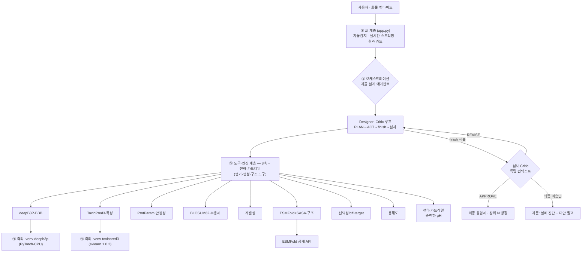
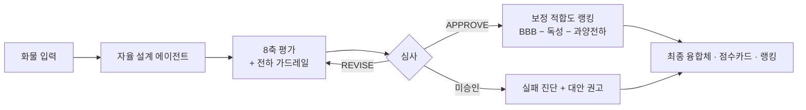
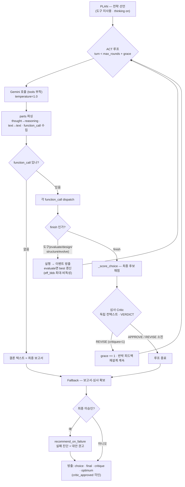

# BBB-Optimize — 상세 기획서

> 뇌혈관장벽(BBB)을 통과하는 항체-셔틀 융합 단백질을 자율적으로 설계·검증하는
> **멀티 에이전트 in-silico 신약설계 시스템**. 본 문서는 사용하는 기술·방법·이론·도구·원리를
> 총정리한 기술 기획서다.

---

# 제출 문서 (공식 제안서 양식 · 6개 항목)

> **제출 서식**: 함초롬돋움 13pt · 줄간격 160%(본문), 부가설명(※)은 11pt · 130%.
> 항목별 `[참고사항]`은 제출 전 삭제. 6개 항목은 공식 제안서 양식과 1:1 대응하며,
> 상세 근거·수식·코드 기준은 각 항목 아래 상세 근거 포함.

## 핵심 3문장 요약

1. **BBB-Optimize**는 혈액뇌장벽(BBB)을 넘길 화물에 셔틀·링커를 붙여 뇌 전달 융합체를 자율 설계하는
   **Designer–Critic 멀티 에이전트**다.
2. 설계 에이전트가 평가·잔기 편집·구조·서열 진화 도구를 스스로 오케스트레이션하며 **off-target 위험을
   감점해 뇌 선택적 RMT를 선호하도록 저울질**하고, 독립 심사 에이전트가 이를 **적대적으로 반박**해
   deepB3P 편향에 낚인 "BBB만 높은 비특이(CPP) 후보"(지표 게이밍)를 걸러낸다.
3. deepB3P·ToxinPred3·ESMFold 오픈소스 **실엔진으로 실제 동작**하며, 셔틀은 무작위 생성 없이 **검증
   리간드에서 진화**시키고 결과를 절대치가 아닌 **후보 간 상대 순위로 정직하게** 제시한다.

## 1. 신약개발에서의 에이전트 활용의 필요성과 배경

**□ 해결하려는 문제 (명확한 정의)** — 뇌 질환 치료제, 특히 항체(~150 kDa)는 혈액뇌장벽(BBB)에 막혀
**투여량의 0.1~0.2%만 뇌에 도달**한다. 이를 뚫기 위해 검증된 **셔틀 펩타이드**를 링커로 화물(항체·
펩타이드)에 융합해 **수용체매개수송(RMT)**을 히치하이킹한다. 그러나 설계 공간이 근본적으로 어렵다:
- **단순 조립이 아니다 → 잔기 수준 조합 폭발**: 실제 신약개발은 검증된 셔틀·링커를 **그대로 붙이는 게
  아니라**, 접합부 안정성·개발성·면역원성·친화도(sweet-spot)를 맞추려 **잔기 수준 편집**(point
  mutation·트리밍·하이브리드·전하 조정)으로 미세조정한다(산업 셔틀도 monovalent화·친화도 튜닝으로
  최적화 — 예: *Trontinemab*). → 설계 공간이 `링커 × 셔틀 × 잔기 편집`으로 **사실상 무한 폭발**하므로,
  사람이 일일이 저울질하기 어렵다(본 에이전트는 `design_candidate`로 잔기 편집을 직접 수행).
- **다목적 상충**: BBB 투과↑가 **독성·불안정·off-target·용해도**와 동시에 충돌.
- **sweet-spot 역설**: RMT는 "친화도가 너무 높으면 뇌 쪽에서 방출되지 못해 오히려 전달↓" → **단순
  최대화가 답이 아니다**. 이 다목적을 저울질하며 **관찰→판단→재설계**하는 **자율 탐색**이 필요하다.

**□ 도메인 지식의 AI 논리 반영** — 제약·생화학 지식을 에이전트의 **평가 축과 판단 로직에 직접 인코딩**:
- **항체-셔틀 융합의 생물학 → 계산 축 1:1 매핑**: 융합체가 실제로 뇌에 도달하려면 ⑴ 셔틀이 표면에
  **노출**돼 수용체에 결합(파묻히면 실패), ⑵ luminal에서 붙고 abluminal에서 **방출**돼야 함(친화도가
  너무 높으면 리소좀 분해→전달 실패, **sweet-spot**), ⑶ **monovalent**로 수용체 가교·분해 회피
  (*Trontinemab* 원리), ⑷ 연결부위가 프로테아제에 안 잘림, ⑸ 비특이 CPP가 아닌 **RMT 선택성**이어야
  뇌 특이. → 각 조건을 **구조 노출·avidity·결합가·개발성·선택성 축**으로 인코딩(상세 §1.2).
- **선택성 축을 RMT 생물학·산업 사례에 근거해 설계**: 셔틀이 혈관 쪽(luminal) 수용체(TfR·LRP1)에
  결합해 세포를 통과(transcytosis)하는 **RMT 기전**, 그리고 실제 성공 사례(Roche *Brain Shuttle*·
  Denali *Transport Vehicle*·*Trontinemab*의 **monovalent·수용체 선택적** 설계)를 근거로 →
  우리 **선택성 축이 "비특이 CPP보다 수용체 선택적 RMT를 선호"**하도록 만들었다(임의 기준이 아님).
- 개발성 liability(탈아마이드화·이성질화·N-당화·산화·프로테아제 절단)를 서열 규칙으로 인코딩.
- **[핵심] deepB3P 점수의 개념 혼동 제거** — "짧은 펩타이드용 투과 분류기"를 큰 융합체 투과율처럼
  쓰지 않도록, 점수를 **셔틀 내재 투과 × 융합 보존 × 메커니즘(RMT/CPP) 타당도 + avidity**로 **분해**해
  해석한다(§2.9.5). 계산이 유효한 범위(상대 순위)와 실험이 필요한 범위(절대 투과율)를 나누는
  **Tier 로드맵**으로 도메인 성숙도를 함께 제시한다.

### 1.1 뇌 질환 치료의 병목 = BBB
뇌혈관장벽(Blood-Brain Barrier)은 혈관내피 세포의 tight junction으로 형성된 선택적 장벽으로,
분자량 큰 치료제(특히 항체, ~150 kDa)의 뇌 진입을 거의 막는다. 알츠하이머 항체 치료제도
**투여량의 0.1~0.2%만 뇌에 도달**하는 것이 근본 한계다.

### 1.2 해결 전략 — 항체-셔틀 융합
검증된 **셔틀 펩타이드**(예: Angiopep-2)를 링커로 항체에 연결해, 셔틀이 BBB의
**수용체 매개 수송(RMT, Receptor-Mediated Transcytosis)** 경로를 "히치하이킹"하게 한다.

**RMT 원리**: 셔틀이 혈관 쪽(luminal) 수용체(LRP1·TfR 등)에 결합 → 세포내이입(endocytosis)
→ 세포를 가로질러 수송(transcytosis) → 뇌 쪽(abluminal)에서 방출. 산업 사례: Roche
*Brain Shuttle*, Denali *Transport Vehicle*.

> **[north-star 산업 사례] 로슈 Trontinemab — 임상 3상 진입 (2026, AAIC 발표)**
> Trontinemab은 로슈의 **BrainShuttle 항체**(2+1 이중특이체)로, **TfR1 매개 수송**으로 BBB를 넘는
> 항-아밀로이드 알츠하이머 치료제다. **Phase 3 프로그램**(초기 알츠하이머 대상 **TRONTIER 1·2**,
> 고위험 무증상 대상 예방시험 **PrevenTRON**)에 진입했다. 핵심 성과가 **본 시스템의 설계 축을 실제로
> 검증**한다:
> - **TfR 셔틀** — 우리가 라이브러리에 추가한 T7·B6(TfR) 셔틀·선택성 축과 정렬.
> - **monovalent TfR arm**(2+1 포맷) — 수용체 가교·리소좀 분해를 피하는 **결합가·sweet-spot 원리** 그대로.
> - **낮은 전신 용량으로 효율적 CNS 전달**, **ARIA-E < 5%**(레카네맙 13%·도나네맙 24% 대비 현저히 낮음)
>   → "무조건 세게"가 아니라 **선택성·적정 친화도**가 뇌 전달·안전성을 좌우함을 임상이 입증.
>
> 즉 우리의 **TfR 셔틀·monovalent sweet-spot·선택성 우선** 설계는 임상 3상 최전선 물질과 같은 원리를
> 따르며, Trontinemab을 **north-star**로 삼는다.

**융합체가 실제로 뇌에 도달하려면 (생물학적 조건 — 각 조건이 우리 평가 축이 된다)**:
- **셔틀 노출**: 융합체를 접었을 때 셔틀이 **표면에 드러나야** 수용체에 결합한다 — 화물 벌크에 파묻히면
  (occluded) 결합 실패. → **구조 노출도 축(ESMFold+SASA, §3.1.5)**.
- **친화도 sweet-spot(방출)**: luminal(혈관쪽)에서 결합해 들어간 뒤, **abluminal(뇌쪽)에서 다시
  방출돼야** 전달이 완료된다. **너무 세게 붙으면(저 KD) 방출 못 하고** 엔도좀→리소좀 분해·수용체
  재순환으로 되돌아가 전달 실패 → **중간 친화도**가 유리. → **avidity/sweet-spot 축(§2.9.6)**.
- **결합가(valency)**: **monovalent**가 수용체 가교(crosslinking)를 피해 리소좀 분해 경로를 줄인다
  (Roche *Trontinemab* 원리). → **결합가 감점 로직**.
- **연결부위 무결성**: 링커는 유연하되 **프로테아제 절단부위(KR/RR 등)가 없어야** 체내에서 잘리지
  않는다. → **개발성 축(§3.1.6)**.
- **선택성**: RMT(수용체 특이)여야 뇌에 선택적으로 가고, 비특이 CPP는 온몸에 퍼져 off-target·독성.
  → **선택성 축(§3.1.8)**.

즉 "셔틀을 항체에 붙인다"는 한 줄 뒤엔 **노출·방출·결합가·안정성·선택성**이라는 다층 생물학이 걸려
있고, 본 시스템은 이 조건들을 **각각의 계산 축**으로 인코딩해 저울질한다.

> **본 시스템의 계산 대상 = 이 "셔틀·링커(전달 모듈)"의 설계·최적화**다(항체 자체가 아니라 **뇌로
> 넘기는 부품**을 설계 — Roche/Denali가 항체에 붙이는 그 셔틀에 해당). 항체 전달은 **동기·응용
> 맥락**이고, 화물은 **펩타이드~작은 단백질을 완전 평가**한다. 대형 항체 화물도 입력·셔틀 설계는
> 되지만(BBB는 연결부위만 보므로 화물 크기 무관), **항체 자체의 완전 평가(Fv 개발성·결합)는
> Tier-2**로 분리한다(§1.5 적용 범위). 즉 "**셔틀 설계는 완전 · 항체 화물 완전 평가는 향후**".

### 1.3 왜 어려운가 — 조합 폭발 + 상충
링커(길이·유연성·전하)와 셔틀 조합은 방대하고, **효능↑이 독성↑·불안정↑과 상충**한다.
게다가 RMT는 "친화도가 너무 높으면 뇌 쪽에서 안 떨어지는" **친화도 sweet-spot** 현상이 있어
단순 최대화가 답이 아니다. → **다목적을 저울질하는 자율 탐색**이 필요.

### 1.4 왜 도구들을 오케스트레이션하는가 (자율 에이전트인 이유)
**단일 도구로는 답이 안 나온다.** BBB(deepB3P)는 독성·구조·선택성을 말해주지 않고, 각 축은 **부분적
신호**이며 **서로 상충**한다(§1.3). 좋은 후보는 여러 축을 **동시에** 만족해야 하므로, 여러 도구를
돌려 **결과를 종합해 판단**해야 한다 — 이것이 오케스트레이션의 1차 이유다.

**게다가 다음에 무엇을 할지가 중간 결과에 따라 달라진다** — 고정 순서로는 대응 불가:
- 후보가 **off-target(비특이)**로 나오면 → **잔기 편집(`design_candidate`)**으로 재설계.
- 셔틀이 구조상 **파묻히면** → **링커 교체** 또는 구조 검증(`analyze_structure`).
- 라이브러리 조합이 **다 부족하면** → **서열 진화(`evolve_from_library`)**로 라이브러리 밖 탐색.
- **충분히 수렴하면** → 스스로 `finish` (고정 스텝 낭비 없이 종료).

즉 **"어떤 도구를, 언제, 왜 호출할지"를 중간 관찰에 근거해 스스로 결정**(관찰→판단→행동→재판단)하는
것이 실제 설계 과정이고, 고정 파이프라인이 아니라 **자율 에이전트**여야 하는 이유다. 나아가 설계자의
판단을 **독립 심사(Critic)**가 적대적으로 검증(§2.7)해 신뢰성까지 확보한다.

### 1.5 계산의 역할과 한계 — Tier 로드맵

**핵심 인식: 전장 융합체의 실제 BBB 투과율은 서열만으론 원리적으로 예측 불가.** RMT는 셔틀-수용체
결합(친화도·결합가·pH 의존성)에 좌우되고, 이는 실험 물리량이다.

| Tier | 추가 정보 | 가능해지는 것 | 우리 위치 |
|---|---|---|---|
| 1 | 서열만 | 셔틀 모듈 **상대 순위** | ✅ |
| 2 | +3D 구조(복합체 co-folding) | 결합 타당성·대략 랭킹 | 부분(단량체 구조까지) |
| 3 | +측정 친화도(SPR/BLI, pH) | **친화도 sweet-spot 정량 모델링** | 실험 데이터 필요 |
| 4 | +뇌흡수 데이터셋 | 계열 내 ML 예측 | 실험 데이터 필요 |
| 5 | 기전 PBPK 모델 | 뇌 농도-시간 시뮬레이션 | 파라미터 필요 |

**포지셔닝**: 우리는 Tier 1~2(계산이 유효한 영역)에서 **후보를 좁히고**, 그다음은 wet-lab으로 넘긴다.
"어디까지가 계산의 몫인지 정확히 아는 것"이 도메인 성숙도. 실험 데이터가 들어오면 Tier 3+로 확장되는
구조로 설계.

**적용 범위(scope) — 정직한 경계**:
- **최적화 대상(링커+셔틀)은 항상 펩타이드 스케일** → 화물이 무엇이든 셔틀·링커 설계는 작동한다.
- **화물**: 펩타이드~작은 단백질은 8축 전부 신뢰성 있게 평가. **대형 항체 화물**도 입력·설계는 되지만
  (BBB는 연결부위 윈도잉으로 셔틀만 보므로 무관), 전체-구조체 축(독성 ToxinPred3·개발성·구조)은
  **펩타이드 스케일로 보정**돼 있어 대형 항체엔 미보정 → "셔틀 설계 참고용"으로만 해석해야 한다.
- **항체를 화물로 완전 평가**(Fv developability·Fab-수용체 결합)하려면 **Tier-2(구조 기반)**가 필요하며,
  이는 자원(GPU·co-folding)·검증 요구가 커 **향후 확장**(§6.3)으로 명확히 분리한다. 현재는 "펩타이드
  완전 지원 · 항체는 셔틀 설계까지"가 정직한 위치다.

## 2. 에이전트 설계 및 설계의 독창성과 창의성

**□ 단순 챗봇을 넘어선 자율 설계** — LLM tool-use 루프: **PLAN**(전략 선언) → **ACT**(평가·정밀설계·
구조 도구를 스스로 호출) → **finish**(수렴을 스스로 선언) → **CRITIC**(독립 심사) → **REVISE**
(재설계). 라이브러리 선택을 넘어 **잔기 수준 서열 편집**(`design_candidate`)을 직접 제안하는 진짜 설계
행동공간을 가진다. **입력은 항상 화물** 하나로 받아 단일 최적화 경로로 흐른다(모달리티 자동 분기 없음
— 항체든 펩타이드든 "뇌로 전달할 화물"이라는 하나의 문제로 통일).

**□ 왜 도구들을 오케스트레이션하는가** — ⑴ 단일 도구는 **부분 신호**이고 축끼리 **상충**하므로(BBB↑ vs
독성·off-target·안정성) 여러 도구를 돌려 **종합 판단**해야 하고, ⑵ **다음 행동이 중간 결과에 따라
달라진다**: off-target이면 잔기 편집(`design_candidate`), 셔틀이 파묻히면 링커 교체·구조 검증
(`analyze_structure`), 라이브러리가 다 부족하면 서열 진화(`evolve_from_library`), 수렴하면 `finish`.
→ **"어떤 도구를 언제 왜 호출할지"를 스스로 결정**해야 하므로 고정 파이프라인이 아닌 **자율 에이전트**여야
한다(상세 §1.4).

**□ 차별화된 아키텍처 (멀티 에이전트 협업 + 피드백 루프)**:
- **Designer–Critic 멀티 에이전트**: 심사자가 **독립 컨텍스트**로 후보를 적대적으로 반박(8축 + 설계
  실질) → APPROVE/REVISE. 설계자 추론에 오염되지 않은 별도 페르소나.
- **지표 게이밍(reward-hacking) 간파 [독창성 핵심]**: deepB3P가 양이온 CPP를 고평가하는 편향을 이용한
  **"BBB는 높지만 아무 세포나 뚫는 off-target"** 후보를 심사가 **선택성 축**으로 잡아 뒤집는다(실측:
  BBB 0.96 후보를 REVISE).
- **[신규] 전달 축 분해 (delivery decomposition)**: deepB3P 한 숫자를 **셔틀 내재 투과·융합 보존·
  메커니즘 타당도·avidity**로 분해해 "펩타이드 투과 점수 ↔ 항체 RMT 전달"의 개념 혼동을 원천 제거.
  예: Angiopep-2는 **셔틀 단독 0.867인데 융합 0.011** — 단일 숫자면 최고 RMT 셔틀을 꼴찌로 오판하지만,
  분해는 "RMT라 deepB3P는 약한 프록시, 0.011은 참고치"로 정직하게 해석한다.
- **[신규] BBB 하한 게이트**: 최종 후보의 융합 BBB가 `MIN_BBB_SIGNAL=0.15` 미만이면 선택성이 좋아도
  심사가 **결정론적으로 미승인** — near-zero 효능 신호를 확정하지 않는다(선택성 과교정 방지).
- **[신규] 링커·셔틀 서열 directed co-evolution**: 개체 = (셔틀 **서열**, 링커 서열) 두 모듈을 **동시
  진화** — 셔틀은 **검증 라이브러리 리간드에서 시드**해 보존적으로 진화(de-novo 생성 금지), 좋은 셔틀
  계통과 좋은 링커 계통이 교차·재조합되며 공진화(검증: T7(TfR) 변이 `HAIYTSTGR` 등 산출). 에이전트
  도구(`evolve_from_library`)로 호출돼 결과가 8축 재평가에 합류.
- **[신규] 양전하 편향 가드레일**: 생성 적합도에 순전하(pH 7.4)+양친매성(μH) 페널티를 주입해 편향을
  평가 단계뿐 아니라 **생성 단계에서 원천 억제**(무지성 양이온만 감점, Angiopep-2 같은 정당한 RMT
  셔틀은 보존).
- **실패 시 대안 권고 + dual-use 안전판**: 전 후보 미승인이면 원인을 데이터로 진단하고 **실행 가능한
  다음 수**(신규 셔틀 생성·링커 교체)를 권고. 독성 스크리닝(ToxinPred3)을 안전판으로 내장해 유해·
  비특이 후보를 자동 탈락시킨다(§4 M3 2/2 검출).

### 2.1 시스템 아키텍처

시스템은 **4개 계층**(UI · 오케스트레이션 · 도구·엔진 · 격리 실행)으로 나뉜다. **자율 설계
에이전트**가 8축 평가·생성·구조 도구를 스스로 오케스트레이션해 호출하고, 무거운 예측 모델은 의존성
충돌을 피해 **전용 venv subprocess**로 격리 실행된다. 전체 다이어그램(8종)은 별도 문서 [아키텍처.md](아키텍처.md) 참조.



#### 2.1.1 계층별 책임 (4계층)

| 계층 | 코드 | 책임 | 핵심 포인트 |
|---|---|---|---|
| **① UI** | `app.py`(Streamlit) | 입력=화물 **단일 경로**(모달리티 분기 없음), 에이전트 실행 버튼, 이벤트 실시간 렌더, 결과 카드, 과정 기록 | 계산 로직 없는 **얇은 계층** — 표시·스트리밍만 |
| **② 오케스트레이션** | `core/optimizer_agent*.py`, `core/agent.py` | LLM tool-use 루프, Designer–Critic 조율 | 브레인(LLM)은 **교체 가능 계층** |
| **③ 도구·엔진** | `core/*.py` | 8축 평가·생성·구조 예측·전하 가드레일 | 각 엔진은 **독립 모듈**(단일 책임) |
| **④ 격리 실행** | `vendor/*`, venv | deepB3P·ToxinPred3·생성 러너를 전용 venv subprocess로 호출 | 의존성 충돌(**sklearn 1.0.2 핀**) 격리 |

- **② 오케스트레이션**은 도구를 **액션 스키마**(evaluate·design_candidate·structure·generate·finish)로
  LLM에 노출하고, 모델의 도구 호출을 실행→결과 반환하는 **관찰→행동 루프**를 돌린다(§2.6).
- **③ 엔진**은 서로 독립이라 축을 추가·교체해도 다른 축에 영향이 없다(선택성·용해도 축은 후발 추가됨).
- **④ 격리**: deepB3P(PyTorch)와 ToxinPred3(scikit-learn 1.0.2)는 의존성이 충돌 → 각자 venv에서
  `subprocess`로 호출하고 JSON으로 결과 회수. 진화 러너(co-evo)도 deepB3P venv에서 실행.

#### 2.1.2 전체 흐름 — 입력에서 결과 도출까지

입력 1개가 **자율 에이전트 → 8축 평가 + 가드레일 → 심사 → 랭킹 → 산출물**로 수렴한다. 결과는 세 갈래:
**① 승인된 최종 융합체(서열 + 8축 점수카드 + 순전하·μH)**, **② 상위 N 랭킹**, **③ 미승인 시 실패
진단 + 대안 권고**. 모든 과정은 스트리밍·기록되어 **재현·감사 가능**하다.



### 2.2 실행 방식 — 자율 설계 에이전트

실행 방식은 **자율 설계 에이전트**다. LLM이 8축 엔진과 생성·구조 도구를 스스로
오케스트레이션(PLAN→ACT→finish→심사)해 최종 융합체를 설계·검증한다.

| 실행 | 탐색 방식 | 산출 | 용도 |
|---|---|---|---|
| **자율 설계 에이전트** | LLM이 도구를 스스로 오케스트레이션(PLAN→ACT→finish→심사) | 승인된 최종 융합체 + 근거 | 지능형 자율 설계(주력) |

> 동일한 8축 엔진은 **평가 기준선(전수 스윕 oracle — §4.1 M2·M4에서 에이전트 효율을 증명)**과
> 에이전트의 **진화(서열 directed evolution — §3.1.7)·구조(ESMFold — §3.1.5) 도구**로도 재사용된다. 이는 사용자가 고르는
> 별도 모드가 아니라 **에이전트의 탐색을 뒷받침하는 내부 구성요소**다.

### 2.3 진화 도구 — 링커·셔틀 서열 directed co-evolution (에이전트 도구)

에이전트의 **라이브러리 밖 탐색 도구**(`evolve_from_library`). **핵심 원칙: 셔틀은 de-novo 생성하지
않는다** — 수용체 결합 근거 없는 무작위 서열은 셔틀이 아니라 deepB3P 편향을 게이밍하는 가짜이기
때문이다. 대신:
- **셔틀**은 **검증된 라이브러리 리간드(Angiopep·T7·ApoE·RVG29…)에서 시드**해 보존적 point-mutation/
  crossover로 진화한다(잠재공간 GAN 생성 폐기).
- **링커**는 검증 링커 모티프에서 진화한다.
- **(셔틀 서열, 링커 서열) 쌍을 동시에 진화**(co-evolution)해 붙였을 때의 궁합까지 탐색한다 —
  "각자 최적화 후 그냥 붙이기"는 셔틀 단독 BBB 100이 조립 후 59로 떨어지는 연결부위 효과를 놓치지만,
  쌍째 진화는 이를 처음부터 반영한다.

에이전트가 라이브러리 조합·잔기 편집(`design_candidate`)으로 부족하다고 판단하면 이 도구를 호출하고,
**진화 결과는 다시 8축 평가 파이프라인으로 재채점**돼 선택성·delivery 분해·eff_bbb 랭킹에 그대로
합류한다(라이브 세션용 경량 파라미터: rounds 2~3·pop 16). 검증: 진화 산출물이 **T7(TfR) 변이**
(`HAIYTSTGR`, RMT·저 off-target)·SynB1 계열 등 **실제 리간드에서 파생된 서열**로 나온다 — 무작위
생성물이 아니다.

### 2.4 설계 원칙

- **의존성 주입**: `get_predictor()`·`get_toxicity_predictor()`·`get_coevolution()` 팩토리가 설정을
  보고 **로컬 실측을 우선**(원격 API는 대체) 자동 선택. 엔진 미설치 시엔 **예시(데모) 데이터로 화면만
  미리보기**(값이 실제 아님을 명시 — §6.2 연구 진실성).
- **관심사 분리**: UI는 얇게(`app.py`), 계산은 `core/*.py`, 데이터 구조는 dataclass(`schemas.py`).
- **이벤트 스트리밍**: 에이전트는 `AgentEvent`(plan/evaluation/structure/…/critique/final)를 생성기로
  yield → UI가 실시간 렌더 → "과정을 보여주는" 투명성.
- **교체 가능 브레인**: LLM은 독립 계층 → Gemini(기본)/Claude(`with-claude` 브랜치)를 갈아끼워도
  도구·엔진·출력 파이프라인은 동일.
- **자원 경량**: deepB3P·생성 진화는 CPU 실행, ESMFold는 공개 API → 상시 GPU 불필요(CPU 완결).

### 2.5 LLM Tool-Use(Function Calling) 원리
LLM에 **도구 스키마**(이름·설명·JSON 파라미터)를 제공하면, 모델은 자연어 대신 **구조화된 도구 호출**을
출력한다. 시스템이 그 도구를 실행하고 결과를 대화에 되돌려주면, 모델이 다음 수를 결정 —
이 **관찰→행동 루프**를 모델이 "그만"할 때까지 반복한다(수동 agentic loop).

### 2.6 실행 루프 — 계획·실행·자기종료·심사·재설계
```
PLAN(전략 선언) → ACT(도구 자율 호출: 평가·정밀설계(잔기 편집)·구조)
  → 수렴 판단 시 finish(자기 종료) → CRITIC(독립 심사) → APPROVE ┐
                                                     └ REVISE → 재설계 …
```
- **계획(Plan)**: 도구 쓰기 전 전략을 명시적으로 선언 → 근거 있는 탐색.
- **자기 종료(finish)**: 고정 스텝 소진이 아니라 "충분히 수렴"을 **에이전트가 스스로 선언**.
- **정밀 설계(design_candidate)**: 라이브러리 선택을 넘어 **잔기 수준 편집** 서열을 직접 제안 →
  진짜 "설계" 행동공간.
- **재설계 여유(grace)**: 심사 REVISE가 마지막 스텝에 나와도 **개선 1회를 탐색 예산과 별개로 보장** →
  심사 반박이 헛돌지 않고 반드시 한 번은 반영된다.
- **정직한 미승인**: 개선 후에도 통과하지 못하면 결과를 **"심사 미승인"으로 정직하게 표기**한다
  (거부된 후보를 최종 선택으로 위장하지 않음) — 시스템이 자기 실패를 아는 캘리브레이션.
- **실패 시 대안 권고**: 전 후보가 **최종 미승인(막다른)**이면, 자문 에이전트가 실패 원인을 데이터로
  진단하고 **시스템 내 실행 가능한 다음 수**(셔틀 잔기 편집 / 링커 교체 / 다른 셔틀 / 화물 자체
  특성·다른 모달리티)를 우선순위로 권고한다. 화물(치료 목표)은 고정 → 화물 교체는 권하지 않음.

### 2.7 멀티 에이전트 — Designer–Critic (적대적 검증)
- **설계 에이전트**: 후보를 만들고 finish로 제출.
- **심사 에이전트**: **독립 페르소나·독립 컨텍스트**(설계자 추론에 오염되지 않음)로 후보를
  적대적으로 반박 — 독성 마진·안정성·BBB 신뢰도·구조 근거·**개발성 liability·선택성(off-target)·용해도**
  등 8축과 설계 실질을 따져 `VERDICT: APPROVE/REVISE`. REVISE면 심사 반박을 설계자에 피드백해 재설계.
- **지표 게이밍 간파(핵심)**: deepB3P는 양이온성 CPP를 고평가하는 편향이 있어, **BBB 점수는 높지만
  비특이적으로 아무 세포나 뚫는(off-target) 후보**가 나올 수 있다. 심사가 **선택성 축**으로 이를 감지해
  주 지표를 최적화기가 "속인" 경우를 뒤집는다(실측: BBB 0.96 후보를 선택성 근거로 REVISE).
- **이론적 근거**: 단일 에이전트의 자기확신 편향을, **독립적 반대 관점**으로 교정하는
  generator–discriminator/adversarial verification 패턴.

### 2.8 브레인 — Gemini(기본) + AI 안전 오탐 실증
브레인(LLM)은 **교체 가능한 계층**이며, 현재 기본 브레인은 **Gemini**다(정직한 BBB 생물학 프레이밍을
그대로 수용, 거부 없음). 동일 도구·동일 결과 파이프라인에 브레인만 갈아끼울 수 있다.

**부수 실증(AI 안전 인사이트)**: 개발 과정에서 **Claude**를 브레인으로 붙였을 때, 안전 분류기가
"BBB 통과 구조 최적화"를 **양성(benign) 과제임에도 오탐 거부**하는 현상을 관찰했다. 이를 **도메인
중립화**(LLM에는 primary/penalty/index/match 같은 추상 최적화로 제시, 생물학 계산·UI·출력은 그대로
유지)로 우회할 수 있음을 확인했다. → **동일 과제를 두 프런티어 모델이 다르게 다루는 실증**이자 AI
안전 오탐(false-positive)에 대한 엔지니어링 인사이트. (Claude 브레인 전체 구현은 `with-claude`
브랜치에 보존.)

### 2.9 에이전트 설계도 — 완전 구현 명세 (코드 기준)

> `core/optimizer_agent_gemini.py`(브레인 루프)·`core/optimizer_agent.py`(도구 백엔드) 실제 구현 기준.
> 제어 흐름 · 도구 스키마 · 상태 변수 · 축별 산식 · 하이퍼파라미터 · 생성 알고리즘을 전부 명세한다.

#### 2.9.1 전체 제어 흐름 (`run()`)



핵심 특성: **PLAN(계획)→ACT(도구 자율 호출)→finish(자기 종료)→CRITIC(독립 심사)→REVISE(재설계)**.
설계자가 스스로 `finish`를 부를 때까지 관찰→행동을 반복하고, 심사 REVISE는 `grace` 여분 턴으로
**마지막 스텝에 나와도 개선 1회를 보장**한다.

#### 2.9.2 도구(액션) 명세

| 도구 | 파라미터(JSON) | 백엔드 엔진 | 산출 | 비용 |
|---|---|---|---|---|
| `evaluate_candidates` | `rationale`, `constructs[]`={label,linker,shuttle} | deepB3P·ToxinPred3·ProtParam·BLOSUM62·개발성·선택성·용해도·delivery | 후보별 8축+분해 rows | 배치(≤24)·중 |
| `design_candidate` | `label,linker,shuttle,edit_note` | 위 엔진 재사용(1개) | 잔기 편집 서열 채점 | 중 |
| `analyze_structure` | `linker,shuttle` | ESMFold(API)+Shrake-Rupley SASA | 셔틀 노출도·pLDDT | 캐시 히트 즉시 / 미스 ~2~10s, 최대 60s 후 빠른 실패 |
| `evolve_from_library` | `rounds`(2~3) | 링커·셔틀 서열 directed co-evolution(라이브러리 시드) → 8축 재평가 | 진화 후보 rows(라이브러리 밖) | 느림(수십 초~수 분) |
| `finish` | `chosen_label,chosen_linker,chosen_shuttle,final_report` | — | 최종 후보 제출·자기 종료 | — |

#### 2.9.3 상태 변수 & 하이퍼파라미터

| 기호/상수 | 값 | 의미 |
|---|---|---|
| `max_rounds` | UI 슬라이더(기본 8) | 행동 예산(ACT 최대 스텝) |
| `grace` | 0 → REVISE 시 +1 | 재설계 보장용 여분 턴 |
| `MAX_CRITIQUES` | 1 | 재설계(REVISE→개선) 허용 횟수 |
| `best` | 러닝 갱신 | 비독성 중 **유효점수 최대** 후보 |
| `choice` | finish 제출분 | 최종 후보(심사 대상) |
| `MAX_CANDIDATES_PER_STEP` | 24 | evaluate 1회 최대 후보 수 |
| `OFF_TARGET_PENALTY` (λ) | 0.25 | 유효점수 = BBB − λ·off_target |
| `MIN_BBB_SIGNAL` | 0.15 | 최종 확정 BBB 하한(미만=자동 미승인) |
| `TOXICITY_THRESHOLD` | 0.38 | 독성 탈락 기준(ToxinPred3) |
| `MODEL_MAX_LEN` | 50 | deepB3P seq_len(초과=C말단 윈도우) |
| `JUNCTION_FLANK` | 0 | BBB 계산 시 남길 화물 꼬리(0=완전 제외) |
| 요청 타임아웃 | 120,000 ms | Gemini 요청당 상한(stall 무한대기 방지) |
| 재시도 | 6회 · 2·4·6·8·10초 | `_TRANSIENT`(503/429/504/timeout) 백오프 |

#### 2.9.4 LLM 호출 설정

- **설계자(Designer)**: `temperature=1.0`, `thinking.include_thoughts=True`(추론 스트리밍), 도구 스키마 부착.
- **심사자(Critic)**: `temperature=1.0`, `thinking off`, **독립 시스템 프롬프트·독립 컨텍스트**(설계자 thought 미공유).
- **재시도(`_gen_retry`)**: 일시적 오류만 6회 백오프, 그 외 즉시 raise. 안전 차단(SAFETY/BLOCK/RECITATION)은 `error` 이벤트.

#### 2.9.5 평가 파이프라인 산식 (`_evaluate`, 축별)

| 축(컬럼) | 산식/알고리즘 | 기준 |
|---|---|---|
| **BBB(primary)** | deepB3P 5-fold 앙상블 평균 확률. construct>50aa면 **C말단 50자(링커+셔틀) 윈도우** | 0~1(RMT엔 약한 프록시) |
| **shuttleBBB** | deepB3P(셔틀 **단독**) | 분해 ①(내재 투과) |
| **preserv** | clamp(BBB_fusion / shuttleBBB) | 분해 ②(융합 보존) |
| **mech** | target·유사도 → RMT/CPP 분류 + deepB3P 타당도 라벨 | 분해 ③ |
| **독성** | ToxinPred3(AAC+DPC→Extra-Trees) ML score, 전체 서열 | >0.38 탈락 |
| **안정성(index)** | ProtParam 불안정성 지수(Guruprasad) | <40 안정 |
| **수용체유사(match)** | BLOSUM62 전역정렬 score / 자기정렬 정규화 | 0~1 |
| **개발성** | liability 모티프 수 + 응집(소수성 휴리스틱) + pH7.4 순전하 | 낮음/보통/높음 |
| **선택성 off** | cationicity=clamp(전하밀도/0.5), lipophilicity=clamp(GRAVY/0.8); raw=1−(1−cationicity)(1−lipophilicity); **off=clamp(raw·(1−0.6·rmt_sim))** | 0~1, ≥0.6 높음 |
| **용해도** | clamp(0.6·친수성 + 0.2·전하기여 + 0.2·(1−응집)) | 0~1 |
| **avidity** | 항체 KD 있을 때 sweet-spot(§2.9.6) | 0~1(펩타이드 N/A) |

#### 2.9.6 선택·수렴 로직

- **러닝 베스트(best)**: `유효점수 eff_bbb = BBB − λ·off_target` (λ=0.25). evaluate가 낸 비독성 row마다 갱신 →
  BBB만 좇다 양이온 CPP off-target으로 수렴하는 것을 억제.
- **표시축=결정축 일치(랭킹)**: UI 상위 후보(podium)도 raw BBB가 아니라 **동일한 eff_bbb 순**으로 정렬한다.
  → raw BBB 최고여도 비특이 CPP면 밀리므로 "왜 1위(고BBB CPP)를 안 골랐나"는 표시-결정 불일치가 없다
  (예: TAT 융합 raw BBB 0.93·off 높음 → eff 0.69 vs T7(TfR) 0.87·off 낮음 → eff 0.84로 역전).
- **하한 게이트**: 최종 후보 **BBB_fusion < 0.15**면 심사가 **결정론적으로 미승인**(선택성이 좋아도) — near-zero
  효능 신호를 확정하지 않는다. 대응: 링커·`design_candidate`로 보존도 회복 또는 유효점수 상위 후보로 교체.
- **친화도 sweet-spot(항체)**: `ss = exp( −(log₁₀KD − log₁₀100)² / (2·1²) )` — 최적 KD≈100 nM. 과결합(저 KD)=
  리소좀 갇힘, 약결합=미결합 → 중간 친화가 유리(Trontinemab 원리). KD 없으면 N/A.

#### 2.9.7 심사(Critic) 명세

- **독립성**: 설계자 추론에 오염되지 않은 별도 페르소나·컨텍스트로 후보를 **적대적으로 반박**.
- **검증 축**: 독성 마진 · 안정성 · **BBB 신뢰도(RMT면 deepB3P 약한 프록시임을 따짐)** · 구조 근거 ·
  개발성 liability · off-target 선택성 · 설계 실질(뻔한 라이브러리 선택 vs 근거 설계).
- **판정**: 마지막 줄 `VERDICT: APPROVE|REVISE` 파싱, 애매하면 REVISE. **결정론적 게이트**(BBB<0.15)는 LLM
  판정을 덮어 강제 REVISE.
- **재설계**: REVISE → `grace` 턴에서 설계자가 반박을 반영해 `design_candidate` 등으로 개선 후 재-`finish`(1회 보장).
- **최종 미승인**: `recommend_on_failure`가 실패를 데이터로 진단하고 **시스템 내 대안**(셔틀 잔기 편집 / 링커 교체 /
  다른 셔틀)을 권고. **화물(치료 목표)은 고정** → 화물 교체는 권하지 않음.

#### 2.9.8 진화 도구 알고리즘 — 서열 directed evolution(ES)

**셔틀은 de-novo 생성하지 않는다.** 잠재공간 GAN(무작위 z→서열)은 수용체 결합 근거가 없는
가짜 서열(예: `VRCKCSTTCC` 같은 Cys 범벅)을 만들어 deepB3P 편향을 게이밍하므로 폐기했다. 대신
셔틀 유전자를 **아미노산 서열**로 두고 **검증 라이브러리 리간드에서 시드**해 보존적으로 진화시킨다
(링커와 동일한 유전 연산). 실제 루프는 deepB3P venv의 러너가 subprocess로 실행.

**셔틀 유전자(`_run_coevo.py`)** — 검증 리간드 서열의 directed evolution:
```
알파벳: 표준 20 AA, 길이 5~40, 시드 = SHUTTLES 서열(Angiopep-2·T7·ApoE·RVG29·CDX…) 전달
mutate  = 치환0.7(보존적 점변이) / 삽입0.15 / 결실   # 시드에서 크게 벗어나지 않게
crossover = 단일점 재조합(두 셔틀 계통)
이민     = 라이브러리 시드 셔틀(랜덤 z 아님) — de-novo 원천 차단
```

**co-evolution(셔틀 서열 + 링커 서열 동시, `_run_coevo.py`)** — 개체 = (shuttle, linker):
```
링커 유전자: 알파벳 "GSAEKPYWFV", 길이 3~18, 검증 링커(GGGGS·EAAAK…) 시드
child_shuttle = mutate( crossover(eliteA.sh, eliteB.sh) )   # 셔틀 A×B (서열)
child_linker  = mutate( crossover(eliteA.lk, eliteB.lk) )   # 링커 A×B
fitness = (비독성 ? BBB : BBB−1) − charge_penalty − 0.003·len(linker)   # 길이 절약항
elite는 (셔틀·링커) 쌍째 보존 + 이민 2(라이브러리 시드 셔틀·링커)
```
**에이전트 도구화(`evolve_from_library`)**: 에이전트가 호출하면 **라이브 세션용 경량 파라미터**
(rounds 2~3·pop 16·elite 4·timeout 300s)로 짧은 진화 버스트를 돌리고, **진화된 (링커, 셔틀) 쌍을
`_evaluate`에 다시 넣어 8축으로 재채점**한다 → 선택성·delivery 분해·eff_bbb 랭킹에 그대로 합류.
오프라인 벤치마크·재현은 `rounds 4·pop 32·elite 6·seed 2022`.
**공유**: deepB3P 5-fold를 in-process로 1회 로딩, ToxinPred3는 별 venv subprocess, `charge_guardrail`이
순전하(pH7.4)·양친매성(μH) 과다에 페널티를 줘 **진화 단계에서 양이온 편향을 억제**.
**검증**: 진화 산출물이 **T7(TfR) 변이**(`HAIYTSTGR`, RMT·저 off-target)·SynB1 계열 등 라이브러리
리간드에서 파생된 실 서열로 나온다 — 무작위 생성물이 아니다.

## 3. 기술적 실현 가능성

**□ 오픈소스 모델·외부 라이브러리 활용 (구체적·실동작)** — 전 엔진이 목업이 아니라 실제로 돈다:
- **deepB3P**(BBB, PyTorch 5-fold 앙상블) · **ToxinPred3**(독성, scikit-learn Extra-Trees) ·
  **ESMFold**(구조, ESM-2 언어모델 공개 API) · **co-evolution**(서열 directed evolution) ·
  **Biopython**(BLOSUM62 정렬·Shrake-Rupley SASA·ProtParam).
- 의존성 충돌(scikit-learn 1.0.2 핀 등)은 **전용 venv subprocess 격리**로 해결. 팩토리 자동감지로
  **로컬 실측을 우선 사용**(원격 API는 대체 경로). *엔진 미설치 환경에선 화면 확인용 **예시(데모)
  데이터임을 명시**해 렌더만 하고, 실제 예측 결과로 위장하지 않는다*(연구 진실성 §6.2).

**□ 제한된 자원하 현실적 방안** — 프런티어 GPU 없이 **노트북/단일 서버에서 완결**:
- deepB3P 추론·co-evolution 진화 전부 **CPU 동작**(셔틀은 라이브러리 시드 서열 진화라 GAN
  생성기·GPU 불요). ESMFold는 공개 API라 **로컬 GPU 불요**. 저분자 도구(RDKit 등)는 펩타이드/단백질
  모달리티에 부적합해 **의도적으로 배제**.
- **[신규] ESMFold 복원력**: 공개 API(api.esmatlas.com)가 자주 502/503/504·다운 → ⑴ **빠른 실패**
  (per-try 25초 + 총 대기 상한 `deadline=60초`)로 서버가 죽어도 UI가 오래 멎지 않고, ⑵ **데모 캐시
  프리워밍**(`scripts/prewarm_esmfold.py`, 130조합 사전 접기)으로 시연 화물은 네트워크와 무관하게
  항상 구조가 뜬다. 구조 축은 **보조 지표**라 실패해도 나머지 결과(BBB·독성·전달)를 막지 않는다.

| 항목 | 용도 | 예상 소요 규모 |
|---|---|---|
| Gemini API | 에이전트 브레인(function calling) | 세션당 ~10~30 호출(gemini-3-flash, 저비용·저지연) |
| ESMFold API | 융합체 구조 예측 | 건당 1 호출(캐시 시 0), 로컬 GPU 불요 |
| GPU (현재) | deepB3P·생성 진화 | **선택적** — CPU 완결 |
| GPU (Tier 2 확장) | 복합체 co-folding(AF-Multimer/Boltz) | A100급 1장·건당 분 단위 |

### 3.1 예측 엔진 & 이론적 원리

각 엔진은 **무엇을·어떤 원리로·어떤 한계로** 계산하는지 명시한다.

#### 3.1.1 deepB3P — BBB 투과 (효능)
- **무엇**: 펩타이드 서열 → BBB 투과 클래스 **확률(0~1)**.
- **원리**: 딥러닝(트랜스포머 계열) 분류기, **5-fold 앙상블**로 안정화. 아미노산 서열을 임베딩해
  투과/비투과를 학습.
- **한계**: 짧은 펩타이드로 학습 → 긴 융합체의 **절대값 신뢰도 낮음**. 분류 확률이지 실제 투과율 아님.
  양이온성 CPP에 편향(벤치마크 M1에서 확인).

#### 3.1.2 ToxinPred3 — 독성 (안전성)
- **무엇**: 펩타이드 → 독성 위험도(0~1), **> 0.38 탈락**.
- **원리**: **AAC(아미노산 조성) + DPC(이펩타이드 조성)** 특징 → **Extra-Trees** 앙상블(ML-only 모델).
  조성 기반이라 길이 무관, 전체 서열에 적용.
- **한계**: 조성 기반 → 서열 순서·구조 의존 독성은 약함. (GPL-3.0)

#### 3.1.3 ProtParam — 안정성
- **무엇**: 융합체 자체의 분해·응집 경향.
- **원리(불안정성 지수, Guruprasad 1990)**: 서열의 **이펩타이드별 불안정 가중치(DIWV)** 합 ×(10/길이).
  **< 40이면 안정** 예측. 보조: 지방족 지수(Ikai 1980, 지방족 곁사슬 상대 부피), GRAVY(Kyte-Doolittle
  소수성 평균).
- **한계**: 서열 경험식 — 실측 Tm/ΔG 아님.

#### 3.1.4 BLOSUM62 정렬 — 수용체 유사도 (메커니즘 프록시)
- **무엇**: 후보 셔틀이 검증 셔틀과 얼마나 닮았나 → 수송 메커니즘 근거.
- **원리**: **BLOSUM62 치환 행렬**(정렬된 단백질 블록의 치환 로그-확률) 기반 **전역 정렬**
  (Needleman-Wunsch, Biopython `PairwiseAligner`). 참조 셔틀과의 점수를 자기점수로 정규화(0~1).
  참조 셔틀 — **RMT형(수용체 선택적)**: Angiopep-2/-1(LRP1), ApoE(159-167)₂(LDLR/LRP1),
  Leptin30(LepR), **T7·B6(TfR)**, **RVG29·CDX(nAChR)** · **CPP형(비특이 막투과)**: TAT,
  Penetratin, SynB1. 새 RMT 셔틀은 참조 세트에도 등재해 자기 자신을 RMT로 정확히 인식(off-target
  오분류 방지).
- **한계**: **서열 유사도 프록시지 결합 친화도 아님** — Angiopep과 다른 신규 결합자는 낮게 나옴.

#### 3.1.5 ESMFold + Shrake-Rupley SASA — 구조 접근성
- **무엇**: 융합체를 접었을 때 셔틀이 표면 노출인가 vs 화물에 가려졌나.
- **원리**:
  - **ESMFold**: ESM-2 단백질 **언어모델**이 MSA 없이 서열→3D 구조 예측(공개 API). 잔기별 신뢰도
    **pLDDT**(0~100) 동반.
  - **Shrake-Rupley**: 각 원자 주위에 구(球) 점을 뿌려 용매 접근 가능 표면적(**SASA**) 산출 →
    셔틀 영역 **상대 노출도(RSA)**. ≥0.35이면 노출로 판정.
- **한계**: 짧은 펩타이드는 무질서 → 저신뢰(pLDDT 낮음). 노출도는 휴리스틱 프록시(검증된 구조→BBB
  모델 아님).
- **복원력(운영)**: 공개 API가 자주 502/503/504·다운 → ⑴ **sha256(전체서열) 캐싱**, ⑵ **빠른 실패**
  (per-try 25초 + 총 대기 상한 `deadline=60초`, 일시적 5xx만 2·4초 백오프 재시도, 4xx 즉시 실패),
  ⑶ **캐시 프리워밍**(`scripts/prewarm_esmfold.py`로 데모 화물 130조합 사전 접기). 구조는 **보조 지표**라
  실패해도 BBB·독성·전달 결과를 막지 않는다(`_structure`가 에러 텍스트만 반환, 에이전트는 계속 진행).

#### 3.1.6 개발성 엔진 — Developability (서열 liability·응집·전하)
- **무엇**: "만들기 어렵다/불안정하다/비특이 위험"을 실험 전 선별 (TAP 항체 프로파일러의 펩타이드판).
- **원리(생화학)**:
  - **탈아마이드화** N-[G/S/T]: Asn 뒤 작은 잔기 → succinimide 경유 Asn→Asp/isoAsp (NG 최고속).
  - **이성질화** D-[G/S/T/D/H]: Asp succinimide → isoAsp.
  - **N-당화 sequon** N-X-[S/T](X≠P): oligosaccharyltransferase 인식 부위.
  - **자유 Cys**: 짝 없는 시스테인 → 이황화 스크램블·이량체화·응집.
  - **산화** Met/Trp: 표면 노출 시 산화 → 기능 변화·응집.
  - **프로테아제 절단부위** RR/KR/RK/KK: furin·트립신 유사 절단 → 체내 안정성↓.
  - **응집 경향**: 소수성·방향족 패치가 자기회합 유발(휴리스틱: 소수성 비율 + 최장 연쇄).
  - **전하**: pH 7.4 순전하·전하밀도 — **양이온 과다 = 비특이 결합·독성·빠른 청소**(셔틀이 양이온성
    많아 특히 중요).
- **산출**: 위험 낮음/보통/높음 + liability 목록. 검증: TAT 융합=높음(순전하 +8), GS링커=낮음(0).

#### 3.1.7 셔틀 서열 directed evolution — 라이브러리 밖 탐색
- **무엇**: 라이브러리 셔틀을 **개량**해 더 나은 후보를 찾되, **de-novo 생성은 하지 않는다**.
- **원리**: 셔틀 유전자를 아미노산 서열로 두고 **검증 리간드(Angiopep·T7·ApoE·RVG29…)에서 시드**해
  보존적 point-mutation/crossover로 진화. 적합도 = BBB(deepB3P) − 전하 가드레일(양이온 편향 억제),
  독성은 탈락 기준. 잠재공간 GAN 생성을 폐기한 이유: 무작위 z→서열은 수용체 결합 근거가 없는
  가짜(deepB3P 편향 게이밍)라 프로젝트의 reward-hacking 회피 철학과 자기모순이기 때문.
- **한계**: 진화물도 시드 리간드의 **변이체**이므로 실험 검증 필수(실측 대체 아님). 큰 변이는
  드리프트 위험 → 보존적 변이·전하 가드레일·라이브러리 시드 이민으로 억제.

#### 3.1.8 선택성 / off-target — RMT vs CPP (핵심 차별 축)
- **무엇**: 셔틀이 **수용체 선택적(RMT)**으로 뇌에 가나, 아니면 **비특이적(CPP)**으로 아무 세포나
  뚫어 off-target·독성 위험이 큰가.
- **왜 필요**: deepB3P는 **양이온성 CPP를 고평가하는 편향**이 있어, BBB 점수만 보면 off-target 후보를
  최적으로 착각한다. 이 축이 그 함정을 잡는 **안전판이자 본 시스템의 독창성 핵심**이다.
- **원리**: off-target 위험 = (양전하 밀도 ∨ 소수성) × (1 − 0.6·RMT_유사도). 참조 RMT 셔틀
  (Angiopep-2·ApoE·Leptin30)과 닮을수록(수용체 선택적일수록) 위험을 감쇄. 산출: 선택성 점수(0~1) +
  위험도(낮음/보통/높음) + 기전 판정(RMT형/CPP형). 검증: Angiopep-2=0.91(선택적), TAT=0.0(비특이).
- **한계**: 서열 기반 프록시 — 실제 수용체 결합/조직 분포는 실험(면역조직·바이오디스트리뷰션) 확정.

#### 3.1.9 용해도 — Solubility
- **무엇**: 융합체가 수용액에서 잘 녹는가(제조·투여성의 기본 요건).
- **원리**: 0.6·친수성 + 0.2·전하 기여 + 0.2·(1 − 응집경향)의 가중합(0~1). 소수성 덩어리·응집 패치가
  크면 감점. 검증: TAT=0.94(높음), GS링커=0.71, 소수성 덩어리=0.0.
- **한계**: 서열 경험식 — 실측 용해도(mg/mL)·완충액 조건 의존성은 실험 확정.

### 3.2 지표 점수 산정 방식 (정밀)

| 지표 | 산정식/알고리즘 | 범위·기준 | 해석 |
|---|---|---|---|
| BBB 투과 점수 | deepB3P 5-fold 앙상블 확률. 융합체 >50aa면 **연결부위(링커+셔틀)만 윈도잉** | 0~1 | 상대 비교용(실제 투과율 아님) |
| 독성 | ToxinPred3(AAC+DPC→Extra-Trees), 전체 서열 | >0.38 탈락 | 안전성 스크리닝 |
| 안정성 | ProtParam 불안정성 지수(Guruprasad) | <40 안정 | 분해·응집 경향 |
| 수용체 유사도 | BLOSUM62 전역정렬 / 자기점수 정규화 | 0~1 | 수송 메커니즘 근거 |
| 구조 노출도 | ESMFold → Shrake-Rupley RSA + pLDDT | ≥0.35 노출 | 셔틀 접근성 |
| 개발성 | liability 모티프 + 응집 휴리스틱 + pH7.4 순전하/밀도 | 낮음/보통/높음 | 제조·안정성 위험 |
| **선택성/off-target** | (전하∨소수성)×(1−0.6·RMT유사) | 0~1, 낮음/보통/높음 | RMT(선택적) vs CPP(비특이) — 지표 게이밍 방지 |
| 용해도 | 0.6·친수성+0.2·전하+0.2·(1−응집) | 0~1 | 제조·투여성 |

### 3.3 연결부위 윈도잉 (설계 근거)

**문제**: 항체 융합체(수백 aa)는 deepB3P 학습 분포(짧은 펩타이드) 밖 → 전체 서열 점수 신뢰 불가.

**해법**: 융합체가 50aa 초과 시 BBB는 **연결부위(링커+셔틀)만** 계산(화물 벌크 제외, 독성은 전체 서열).

**정당성(단순 우회가 아님)**: 항체 화물은 **혼자선 BBB를 못 넘고**, 투과를 담당하는 건 **오직 셔틀**이다.
→ 연결부위만 보는 것은 길이 제약 회피이자 **실제 투과 기능 모듈만 정확히 겨냥**하는 것. 화물 벌크를
넣으면 조성 편향 노이즈만 섞인다(검증: 화물 포함 시 링커 민감도 소실 → flank=0 채택).

### 3.4 기술 스택 & 재현성

| 구분 | 기술 |
|---|---|
| 언어·UI | Python 3.9, Streamlit |
| LLM 브레인 | **Google Gemini**(`google-genai`, function calling) — 기본. (Anthropic Claude 구현은 `with-claude` 브랜치 보존) |
| 서열·구조 | Biopython(정렬·SASA·ProtParam), ESMFold 공개 API, requests, py3Dmol(3D 뷰) |
| 예측 모델 | deepB3P(PyTorch, 격리 venv), ToxinPred3(scikit-learn 1.0.2, 격리 venv) |
| 진화(탐색) | 링커·셔틀 서열 directed co-evolution(에이전트 도구, deepB3P venv) — 라이브러리 시드 |
| 미사용 | **RDKit 등 저분자 도구** — 펩타이드/단백질 모달리티에 부적합(Ro5 등 미적용) |

**재현성**: 제3자 코드·가중치는 라이선스·용량상 repo 제외, `README.md`에 clone+모델+venv 절차.
벤치마크(M1~M3)는 로컬 엔진만으로 누구나 `python benchmark.py`로 재현.

## 4. 에이전트 평가 적절성

**□ Evaluation set + 평가 지표 M1~M5 실측** (`benchmark.py` 로컬·LLM 0회 / `benchmark_agent.py`
라이브 · 상세 `EVALUATION.md`):

| 지표 | evaluation set·방법 | 실측 결과 |
|---|---|---|
| **M1 판별력** | 양성(CPP/셔틀 12) vs 무작위/스크램블, deepB3P 점수 분리(AUC) | **AUC 0.807**(vs 무작위), 0.618(vs 스크램블) |
| **M2 최적성** | 라이브러리 전수 oracle — 130조합(링커13×셔틀10) | 최적 BBB **0.960**(직접융합+SynB1) |
| **M3 가드레일** | 알려진 독소(멜리틴·마스토파란) 탈락 검증 | **2/2 검출**, 비독성 오탈락 0 |
| **M4 에이전트 효율** | 에이전트 평가 횟수 vs oracle·무작위 | **22평가로 최적의 96.8%**(무작위 24평가 71.6%) |
| **M5 심사 효과** | 불량 후보(독성·저BBB) REVISE 검출률 | **2/2 REVISE**, 경계선 CPP도 보수적 반려 |

> ※ M2·M4는 RMT 셔틀 확장(TfR: T7·B6, nAChR: RVG29·CDX → **10셔틀·130조합**) 기준 **재측정 완료**.
> M1(양성 12종 AUC 0.807)·M3(독소 2/2)은 라이브러리와 무관해 불변 확인. M4는 라이브 1세션치(LLM
> 확률적)이며, 22평가로 96.8% 도달은 무작위 24평가 71.6% 대비 명확한 우위.

**편향 정량·보정 검증**: 양전하 가드레일 단위검증 — TAT(+8)→페널티 0.20, **Angiopep-2(+2)→0**(정당한
RMT 셔틀 보존). co-evolution 재실행 시 우승자 순전하 **+4 → +1**로 저전하화 확인.

### 4.1 성능 평가 방법론 (Evaluation Set + Metrics)

`benchmark.py`(로컬·LLM 0회) / `benchmark_agent.py`(LLM 필요). 상세 `EVALUATION.md`.

**M1~M5 전부 실측 완료**(M1~M3 로컬·무료 재현 / M4~M5 Gemini 라이브):

| 지표 | 방법 | 실측 결과 |
|---|---|---|
| **M1 판별력** | 양성(CPP/셔틀 12) vs 무작위/스크램블 deepB3P 점수 분리(AUC) | **AUC 0.807**(양성 vs 무작위), 0.618(vs 스크램블) |
| **M2 최적성·효율** | 라이브러리 전수(oracle) 최적 vs 무작위 탐색 효율 곡선 | 130조합(링커13×셔틀10), 최적 BBB **0.960**(직접융합+SynB1); 비독성 110/130; 무작위 12회→66.2%·24회→71.6%(시드20 평균) |
| **M3 가드레일** | 알려진 독소(멜리틴·마스토파란) 탈락 검증 | 검출 **2/2**, 비독성 오탈락 0 |
| **M4 에이전트 효율** | 에이전트 평가 횟수 vs oracle·무작위 | **22평가로 최적의 96.8%** 도달(전수 130 중, 라이브 1세션) — 무작위 24평가 71.6% 대비 명확한 우위 |
| **M5 심사 효과** | 불량 후보 REVISE 검출률 | 명백 불량 **2/2 REVISE**(독성 멜리틴·저BBB poly-Ser), 경계선 CPP도 보수적 반려 |

## 5. 본선 시연 시나리오 — 단계적 문제해결의 시각화

**□ 복잡한 문제를 단계별로 해결하는 과정을 어떻게 시각화할 것인가** — 에이전트의 문제해결 전 과정을
**Streamlit UI에 실시간 스트리밍**하도록 이미 구현돼 있어, "블랙박스 결과"가 아니라 **사고·판단 과정
자체**를 보여준다(=투명성·재현·감사 가능).

**라이브 흐름 (한 세션 ≈ 수십 초~수 분)**
1. **입력**: 화물 서열 1개 → **항상 화물로 처리**(단일 최적화 경로, 모달리티 분기 없음).
2. **PLAN 카드**: 도구 사용 전 전략을 선언 → 화면 렌더("근거 있는 탐색").
3. **ACT 스트리밍**: 평가·정밀설계(잔기 편집)·구조 도구 호출이 이벤트 카드로 차례로 등장(도구·입력·점수).
4. **[하이라이트] 지표 게이밍 간파**: 설계자의 BBB 0.96 후보 → 심사가 **양이온 off-target으로 REVISE**
   → 재설계 → APPROVE. 에이전트가 스스로를 반박·교정하는 순간을 화살표·배지로 강조.
5. **[하이라이트] 전달 축 분해 표시**: 후보별로 **셔틀 내재·융합 보존·메커니즘(RMT/CPP)·avidity**를
   병기 → "이 숫자는 RMT라 참고치"임을 화면에서 정직하게 설명(개념 혼동 방지의 시각화).
6. **진화 데모**: **링커-셔틀 서열 co-evolution**(셔틀은 검증 리간드 시드 진화) → **라운드별 BBB 개선 +
   평균 순전하 하강** 라인차트.
7. **최종 카드**: 8축 요약 + **순전하·μH 병기** + 전체 서열. 미승인 시 **실패 진단 + 대안 권고**까지
   정직 표기.

**시각화 요소**: 이벤트 타임라인 · 8축 배지 · 전달 분해 패널 · 진화 라인차트(BBB↑·전하↓) · 구조 3D
뷰(py3Dmol) · 심사 REVISE→재설계 화살표.

## 6. 에이전트 도입에 따른 파급효과

**□ 시간·비용·동물실험 절감 (사전 스크리닝 funnel)** — 후보를 실험으로 하나씩 합성·검증하면 비용·
시간·**동물실험** 부담이 크다. 링커13×셔틀10=130 조합 + 잔기 정밀설계·서열 directed evolution(사실상 무한) → **8축
평가·적대적 심사로 상위 소수만** 실험 대상으로 선별. 심사가 off-target·불안정 후보를 앞단에서 탈락 →
"실험에서야 실패를 발견"하는 후행 실패비용을 사전 제거. (실제 절감폭은 표적·기관별로 달라 정량 단정
대신 *funnel 축소* 방향으로 제시.)

**□ 실제 제약바이오 산업·연구 현장 적용성** — 항체의 뇌 전달은 제약업 대표 난제(Roche·Denali 실제
플랫폼 존재)로 문제의식이 산업과 정렬. 뇌표적 신약 **초기 후보 발굴** 단계의 셔틀·링커 조합 선별
**의사결정 보조 도구**이며, 투명한 과정 기록으로 "왜 이 후보인가"를 추적·재현할 수 있어 현장 채택성이
높다. in-silico 결과는 **실험 검증 전 사전 스크리닝**이며 최종 판단·책임은 연구자에게 귀속(과대 주장
지양).

**□ 신약개발 프로세스 혁신 & 산업 경쟁력** — ① 고정 파이프라인 → **관찰·판단·재설계 자율 에이전트**로
탐색 패러다임 전환. ② **reward-hacking 방지·전달 축 분해·BBB 하한 게이트 내장**으로 AI 자율설계의
신뢰성 문제를 구조적으로 완화 — 산업 이식의 핵심 가치. ③ 브레인·도구·평가축이 교체·확장 가능 → 다른
표적·모달리티·규제/면역원성 축으로 수평 확장하고, 실험 데이터가 쌓이면 **Tier 3+**(측정 친화도·뇌흡수
ML)로 성장하는 지속가능 플랫폼.

### 6.1 비즈니스 & 사회적 가치

#### 6.1.1 시간·비용·동물실험 절감 (사전 스크리닝 funnel)
항체-셔틀 후보를 실험으로 하나씩 합성·검증하는 것은 **비용·시간 부담이 크고** 동물실험을 수반한다.
본 시스템은 **계산으로 후보를 먼저 좁혀** wet-lab에 넘길 후보 수를 줄인다.
- **깔때기(funnel)**: 링커13 × 셔틀10 = **130 조합**(+ 잔기 수준 정밀 설계·서열 directed evolution까지 사실상 확장 무한)
  → 8축 평가·심사로 **상위 소수 후보만** 실험 대상으로 선별.
- **효과(정성)**: 합성·검증할 물리적 후보 수가 **크게 감소** → 시약·인건비·기간·동물실험을 **크게 절감**.
  (실제 절감폭은 표적·기관별로 달라 본 문서는 정량 단정을 지양하고 *funnel 축소*라는 방향으로 제시한다.)
- 심사 에이전트가 **off-target·불안정 후보를 앞단에서 탈락**시켜, "실험에서야 실패를 발견"하는 후행
  비용을 사전에 제거한다.

#### 6.1.2 실제 산업·연구 현장 적용성
- **미충족 수요**: 항체의 뇌 전달은 제약업의 대표 난제이며 **Roche Brain Shuttle·Denali Transport
  Vehicle** 등 실제 플랫폼이 존재. 특히 로슈 **Trontinemab**(TfR 브레인셔틀 항-Aβ)이 **임상 3상**
  (TRONTIER 1·2·PrevenTRON, 2026)에 진입 → 셔틀 기반 뇌 전달이 **최전선에서 검증되는 유효 전략**임을
  방증하며, 본 시스템의 문제의식이 산업과 정렬(§1.2 north-star 참조).
- **적용 시나리오**: 뇌 표적 항체·펩타이드 신약의 **초기 후보 발굴 단계**에서 셔틀·링커 조합을 빠르게
  선별하는 **의사결정 보조 도구**. 실험 데이터가 쌓이면 Tier 3+로 확장(측정 친화도·뇌흡수).
- **투명한 과정 기록**으로 "왜 이 후보인가"를 추적·재현할 수 있어 연구 현장 채택성이 높다.

### 6.2 연구 윤리 & 안전성

공고문 「AI 활용 연구 윤리 가이드라인」 4개 권고에 1:1로 대응한다.

| 권고 | 본 시스템의 준수 |
|---|---|
| **연구 진실성**(표절·위조·변조 금지, 참고문헌 실재) | 셔틀·평가세트 서열은 모두 **문헌 실측**이며 **서열 날조 금지**가 원칙. 점수는 실제 모델(deepB3P·ToxinPred3) 출력이지 임의 생성이 아니다. 셔틀은 de-novo 생성하지 않고 **검증 리간드에서 진화한 변이체로 명시**(실험 서열로 위장하지 않음). **엔진 미설치 환경의 예시(데모) 데이터는 화면에 "예시·미리보기"로 명시**해 실제 결과로 위장하지 않는다(디자인 확인용). |
| **투명성**(프롬프트·모델명·설정값 기록·공개) | 브레인 모델(Gemini)·설정을 공개하고 에이전트의 **계획·추론·평가·심사 전 과정을 스트리밍·기록**(과정 기록)해 재현·감사 가능. |
| **안전성**(유해물질 등 위험 사전 검토) | BBB 전달의 **이중용도(dual-use)** 성격을 인식하고, **독성 스크리닝(ToxinPred3 가드레일, M3에서 2/2 검출)**을 안전판으로 내장해 독성 후보를 자동 탈락. 목적은 **치료제 뇌 전달**(유익)이며 유해 화물 설계가 아니다. |
| **최종 책임**(연구자 귀속) | in-silico 결과는 **실험 검증 전 사전 스크리닝**임을 일관되게 명시(§1.5 Tier). 과대 주장(임상 효과 단언)을 하지 않으며 최종 판단·책임은 연구자에게 있음을 전제한다. |

### 6.3 한계 & 향후 확장

**한계(정직성)**
- BBB 점수는 분류 확률 — 실제 투과율(Papp/logBB)은 in-silico 확정 불가.
- deepB3P 절대값 신뢰도 낮음(양이온 편향), 수용체 유사도는 서열 프록시, 구조 노출도는 휴리스틱.
- 실제 개발 전 In Vitro(transwell Papp)/In Vivo(brain:plasma) 검증 전제.

**확장**
- **Tier 2 — 항체 화물 완전 지원(구조 기반)**: 현재 개발성은 서열 규칙 휴리스틱(TAP 개념의 펩타이드판)
  이다. 항체 화물을 완전히 다루려면 ⑴ **ABodyBuilder로 Fv 구조 모델링 → TAP(Therapeutic Antibody
  Profiler)의 5지표**(CDR 길이·PSH·PPC·PNC·SFvCSP)로 항체 developability 실측, ⑵ 셔틀-수용체
  **복합체 co-folding**(AlphaFold-Multimer/Boltz)로 결합 타당성을 붙인다. **자원(GPU)·검증 요구가 커
  현재의 "노트북 CPU 완결·Tier-1 인터랙티브" 설계와 분리**하며, 실험 데이터가 준비되면 활성화한다.
- Tier 3 훅: **측정 친화도 입력** 시 sweet-spot 근접도 점수화.
- **실패 시 자동 대안 시도**: 현재 대안 *권고*(A)에서 → 미승인 시 셔틀 서열 진화(co-evolution)를 **자동 재실행·재심사**(B)로.
- **외부 항체 DB 연동**(SAbDab/Thera-SAbDab): 같은 표적의 **더 전달성 좋은 항체 변이체**를 추천
  (화물 고정 원칙은 유지하되, 사용자가 표적만 줄 때 후보 화물을 제안).
- 분야3 확장: 규제·개발성 에이전트 추가(2+3 융합). 면역원성(T-cell epitope) 엔진 추가.

### 6.4 공모전 분야 & 예선 평가지표 매핑

#### 6.4.1 예선 평가지표 대응 (심사·peer가 바로 찾도록)
| 예선 평가항목(배점) | 대응 위치 | 요지 |
|---|---|---|
| 필요성과 배경 (20) | §1 | BBB 병목·항체셔틀 해결전략·RMT sweet-spot 등 도메인 지식 반영 |
| 에이전트 설계 독창성 (20) | §2 | 계획→실행→자기종료→심사→재설계, Designer-Critic, **지표 게이밍 간파**, 실패 권고 |
| 기술적 실현가능성 (20) | §3.1·§3.4 | 오픈소스 엔진(deepB3P·ToxinPred3·ESMFold) + 서열 directed evolution **실동작**, RDKit 부적합 명시 |
| 에이전트 평가 적절성 (10) | §4.1 | evaluation set + M1~M5 지표 **실측** |
| 비즈니스·사회적 가치 (20) | §6.1 | 사전 스크리닝 funnel로 시간·비용·동물실험 절감, 산업 적용성 |
| 연구 윤리·완성도 (10) | §6.2·§1.5 | 윤리 4항목 1:1 대응 + 정직한 한계·Tier 로드맵 |

#### 6.4.2 공모전 분야 매핑
| 분야 | 부합 | 근거 |
|---|---|---|
| **분야2** 도구 활용 분자 최적화 루프 | 🟢 핵심 | 예측 도구를 루프로 돌려 분자 최적화 — 정의 그대로 |
| **분야4** 융합·멀티 에이전트 | 🟢 | Designer–Critic 멀티 에이전트 구조 |
| **분야1** 자율형 가설 생성·검증 | 🟡 | 검증 셔틀의 **directed evolution으로 개량 가설 생성** + 심사 에이전트의 적대적 검증(가설→검증 루프) |
| 분야3 규제·임상 | ⚪ 향후 | 개발성 축이 규제 대응의 초석(확장 여지) |
