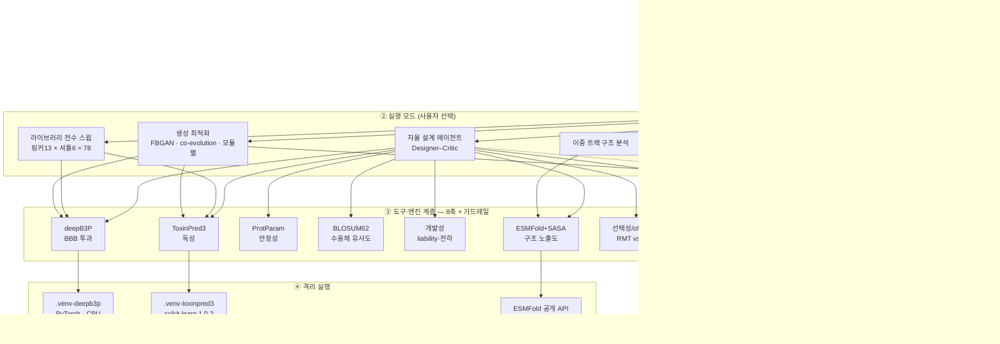
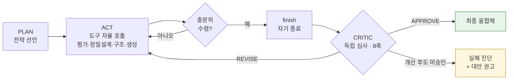
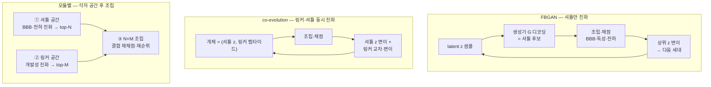
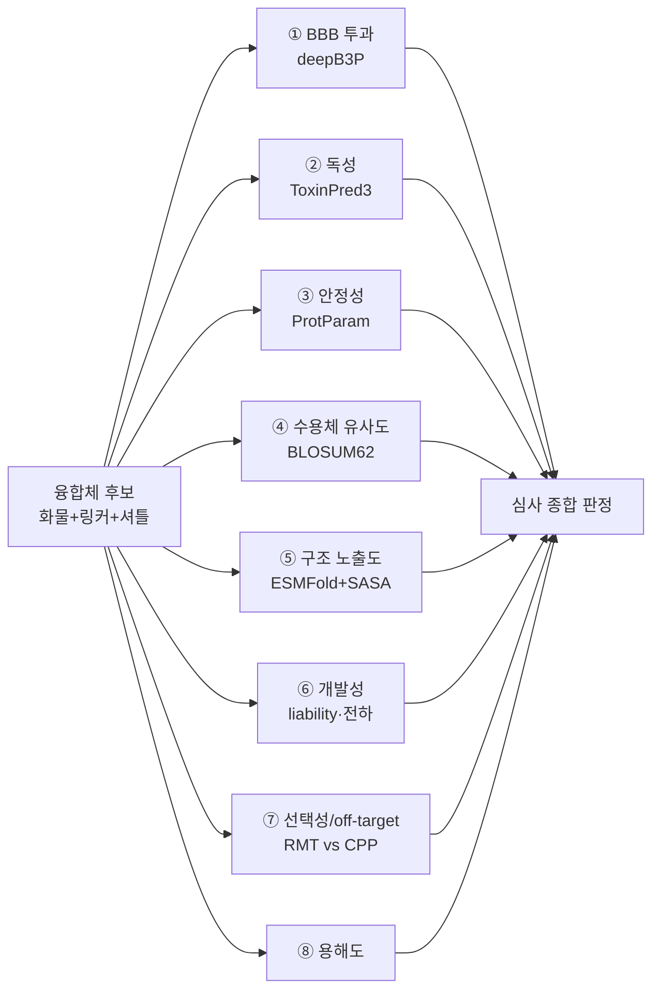
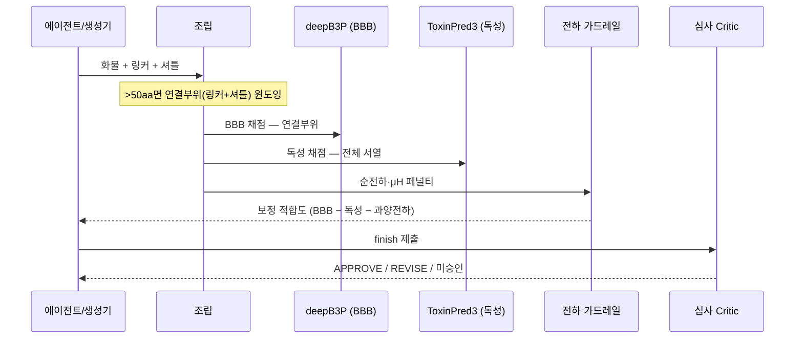
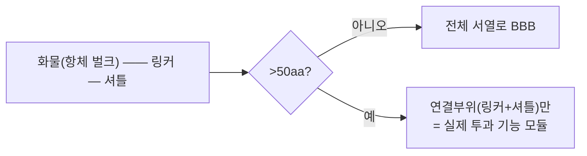
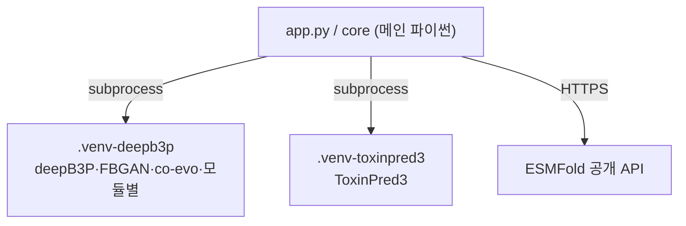

# BBB-Optimize — 시스템 아키텍처 (상세)

> 화물(cargo) 펩타이드를 입력하면 `융합체 = 화물 + 링커 + 셔틀`을 자율 설계·검증하는
> 멀티 에이전트 in-silico 신약설계 시스템의 아키텍처 문서. 각 다이어그램은 GitHub에서 바로
> 렌더된다. 코드 위치는 각 절 끝에 표기.

**읽는 순서**: ①전체 계층 → ②에이전트 루프 → ③생성 최적화 3전략 → ④평가 엔진 8축 →
⑤한 후보의 일생(데이터 흐름) → ⑥연결부위 윈도잉 → ⑦격리 실행·설계원칙.

---

## 1. 전체 계층 구조

시스템은 **4개 계층**으로 나뉜다: UI가 입력·스트리밍을 담당하고, 사용자가 4가지 **실행 모드** 중
하나를 고르면, 그 모드가 **도구·엔진 계층**(8축 + 가드레일)을 호출하며, 무거운 예측 모델은
의존성 충돌을 피해 **격리 venv에서 subprocess**로 실행된다.

- **의존성 주입**: `get_predictor()`·`get_toxicity_predictor()` 등 팩토리가 설정을 보고
  **로컬 실측 > 원격 API > Mock** 순으로 자동 선택.
- **관심사 분리**: UI는 얇게(app.py), 계산은 `core/*.py`, 데이터 구조는 dataclass(`schemas.py`).

📁 `app.py` · `core/config.py`(경로 자동감지) · `core/predictors.py` · `core/toxicity.py`

---

## 2. 멀티 에이전트 루프 — Designer–Critic (적대적 검증)

에이전트는 고정 파이프라인이 아니라 **관찰→판단→행동을 스스로 반복**한다. 설계자(Designer)가
후보를 만들고, **독립 컨텍스트**의 심사자(Critic)가 이를 적대적으로 반박한다.

**핵심 설계**
- **계획(PLAN)**: 도구를 쓰기 전 전략을 명시 선언 → 근거 있는 탐색.
- **정밀 설계(design_candidate)**: 라이브러리 선택을 넘어 **잔기 수준 편집** 서열을 직접 제안.
- **자기 종료(finish)**: 스텝 소진이 아니라 "수렴"을 에이전트가 스스로 선언.
- **재설계 여유(grace)**: 심사 REVISE가 마지막 스텝에 나와도 개선 1회를 **탐색 예산과 별개로 보장**.
- **정직한 미승인**: 개선 후에도 통과 못 하면 결과를 "심사 미승인"으로 표기(거부 후보를 최종으로 위장 안 함).
- **지표 게이밍 간파**: deepB3P가 양이온 CPP를 고평가하는 편향을 이용한 **"BBB는 높지만 off-target"**
  후보를 심사가 **선택성 축**으로 잡아 뒤집는다(reward-hacking 방지).

📁 `core/optimizer_agent_gemini.py`(설계·심사 루프) · `core/optimizer_agent.py`

---

## 3. 생성 최적화 — 3가지 전략

라이브러리 밖의 **신규 서열**을 만드는 세 가지 접근. 모두 deepB3P·ToxinPred3로 채점하고
**전하 가드레일**로 양이온 편향을 억제한다.

| 전략 | 진화 대상 | 상호작용(궁합) | 독성 예측 호출 | 특징 |
|---|---|---|---|---|
| **FBGAN** | 셔틀 latent만 | — (링커 고정) | 매 라운드 | 가장 단순, 셔틀 신규 생성 |
| **co-evolution** | 셔틀 z + 링커 동시 | 진화 중 반영 | 매 라운드 | 링커×셔틀 궁합 탐색 |
| **모듈별** | 각자 공간 따로 | **조립 재순위**에서 회수 | **조립 1회만** | 빠름·해석적, 목적 분리 |

**전하 가드레일(공통)**: `페널티 = 초과양전하 × (0.04 + 0.15·max(0, 0.35−μH))`. 순전하(pH7.4)가
허용치 +3을 넘는 만큼, 양친매성(μH)이 낮을수록(무지성 양이온) 더 크게 감점. 검증: TAT(+8)→0.20,
**Angiopep-2(+2)→0**(정당한 RMT 셔틀 보존).

**모듈별의 궁합 회수 근거**: 셔틀 단독 BBB 100 → 조립 후 59로 하락. "각자 최적화 후 그냥 붙이기"는
이 하락을 놓치지만, ③ 결합 재순위가 잡아낸다.

📁 `core/generative.py`(FBGAN) · `core/coevolution.py` · `core/modular.py`
· `vendor/deepB3P/_run_{fbgan,coevo,modular}.py` · `_physchem.py`(가드레일)

---

## 4. 평가 엔진 — 8축 + 가드레일

각 후보는 **8개 독립 축**으로 평가된다. "효능(BBB)"만 보지 않고 안전·안정·선택성·개발성을 함께
저울질하는 것이 핵심.

| 축 | 무엇을 | 원리(요약) | 한계 |
|---|---|---|---|
| ① BBB 투과 | 투과 확률 | 트랜스포머 5-fold 앙상블 | 양이온 편향, 절대값 아님 |
| ② 독성 | 위험도(>0.38 탈락) | AAC+DPC → Extra-Trees | 조성 기반, 서열순서 약함 |
| ③ 안정성 | 분해·응집 경향 | 불안정성 지수(Guruprasad) | 서열 경험식 |
| ④ 수용체 유사도 | 수송 메커니즘 근거 | BLOSUM62 전역정렬 | 친화도 아닌 유사도 프록시 |
| ⑤ 구조 노출도 | 셔틀 표면 노출? | ESMFold → Shrake-Rupley RSA | 짧은 펩타이드 저신뢰 |
| ⑥ 개발성 | 제조·안정 liability | 모티프+응집+pH7.4 순전하 | 실험 전 프록시 |
| ⑦ 선택성 | RMT(선택) vs CPP(비특이) | (전하∨소수성)×(1−0.6·RMT유사) | 서열 프록시 |
| ⑧ 용해도 | 수용액 용해성 | 친수성+전하+(1−응집) 가중합 | 실측 아님 |

📁 `core/{binding,toxicity,stability,selectivity,developability,structure,solubility}.py`

---

## 5. 한 후보의 일생 (데이터 흐름)

하나의 후보가 조립부터 판정까지 거치는 경로. **BBB는 연결부위만·독성은 전체 서열**로 채점하는
비대칭에 유의.

📁 `core/config.py`(`junction_window`) · `vendor/deepB3P/_run_*.py`(`bbb_region`)

---

## 6. 연결부위 윈도잉 (설계 근거)

**문제**: 항체 융합체(수백 aa)는 deepB3P 학습 분포(짧은 펩타이드) 밖 → 전체 서열 점수 신뢰 불가.
**해법**: 50aa 초과 시 BBB는 **연결부위(링커+셔틀)만** 계산(화물 벌크 제외), 독성은 전체 서열.

**정당성**: 항체 화물은 **혼자선 BBB를 못 넘고**, 투과를 담당하는 건 **오직 셔틀**이다. 화물 벌크를
넣으면 조성 편향 노이즈만 섞인다(검증: 화물 포함 시 링커 민감도 소실 → `JUNCTION_FLANK=0` 채택).

---

## 7. 격리 실행 & 설계 원칙

- **왜 격리**: deepB3P(PyTorch)와 ToxinPred3(**scikit-learn 1.0.2 핀**)는 의존성이 충돌 → 각자
  전용 venv에서 subprocess로 호출, 메인 앱은 얇게 유지.
- **자원 경량**: deepB3P·생성 진화 모두 **CPU 동작**(GAN 재학습 대신 사전학습 생성기 고정 + 잠재
  진화). ESMFold는 공개 API → **로컬 GPU 불요**. 노트북/단일 서버에서 완결.
- **재현성**: 제3자 코드·가중치는 라이선스·용량상 repo 제외(`vendor/`, `.gitignore`). 러너 원본은
  `scripts/deepb3p/`에 추적하고 설치 시 `vendor/deepB3P/`로 복사(README 참조).

📁 `README.md`(설치) · `scripts/deepb3p/*` · `.gitignore`
